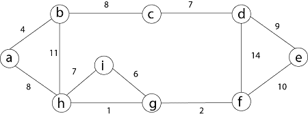
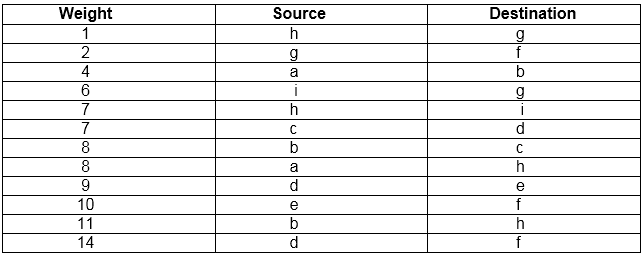
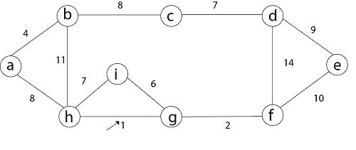
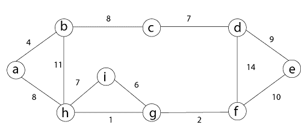
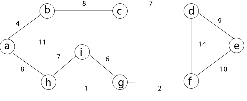
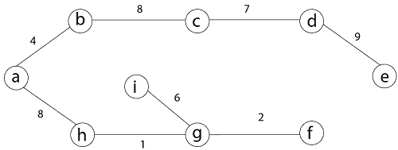

# 最小生成树方法

> 原文：<https://www.javatpoint.com/kruskals-minimum-spanning-tree-algorithm>

有两种方法可以找到最小生成树

1.  克鲁斯卡尔算法
2.  普里姆算法

* * *

## 克鲁斯卡尔算法:

一种构造连通加权图最小生成树的算法。这是一个贪婪算法。贪婪选择是把最小的权重放在不存在的边上，因为到目前为止在 MST 中构造了一个循环。

**如果图没有链接，那么它会找到一个最小生成树。**

**使用克鲁斯卡尔算法查找 MST 的步骤:**

1.  按照重量增加的顺序排列 G 的边缘。
2.  仅从 G 的顶点开始，然后依次添加每条不产生循环的边，直到使用(n - 1)条边。
3.  退出。

```
MST- KRUSKAL (G, w)
 1\. A ← ∅
 2\. for each vertex v ∈ V [G]
 3\. do MAKE - SET (v)
 4\. sort the edges of E into non decreasing order by weight w
 5\. for each edge (u, v) ∈ E, taken in non decreasing order by weight
 6\. do if FIND-SET (μ) ≠ if FIND-SET (v)
 7\. then A  ←  A ∪ {(u, v)}
 8\. UNION (u, v)
 9\. return A

```

**分析:**其中 E 是图中的边数，V 是顶点数，可以显示 Kruskal 的算法在 O (E log E)时间内运行，或者简单地说，O (E log V)时间内运行，所有的数据结构都很简单。这些运行时间是相等的，因为:

*   e 最多为 V <sup>2</sup> 和 log V <sup>2</sup> = 2 x log V 为 O (log V)。
*   如果我们忽略孤立的顶点，这将是它们的最小生成树的每个组成部分，V ≤ 2 E，所以对数 V 是 O (log E)。

因此总时间为

```

O (E log E) = O (E log V).

```

**例如:**用 Kruskal 算法求下图的最小生成树。



**解决方案:**首先我们将集合 A 初始化为空集，并创建|v|树，用 MAKE-SET 过程每个树包含一个顶点。然后将 E 中的边按不递减的权重排序。

有 9 个顶点和 12 条边。所以 MST 形成了(9-1) = 8 条边



现在，检查每条边(u，v)的端点 u 和 v 是否属于同一棵树。如果有，那么边(u，v)不能是补充的。否则，两个顶点属于不同的树，边(u，v)被添加到 A，两个树中的顶点通过并集过程合并。

**第一步:**那么，先取(h，g)边



**第二步:**然后(g，f)边。


**第三步:**然后考虑(a，b)和(I，g)边，森林变成



**第四步:**现在，边缘(h，I)。h 和 I 顶点都在同一个集合中。因此，它创造了一个循环。所以这条边被丢弃了。

然后考虑边(c，d)，(b，c)，(a，h)，(d，e)，(e，f)，森林就变成了。


**步骤 5:** 在(e，f)边中，端点 e 和 f 都存在于同一棵树中，因此丢弃该边。然后(b，h)边，它也创建了一个循环。

**第 6 步:**在此之后，边(d，f)和最终生成树显示为黑线。



**第 7 步:**这一步需要最小生成树，因为它包含所有 9 个顶点和(9 - 1) = 8 条边

```

e → f,	b → h,	d → f [cycle will be formed]

```



最低成本