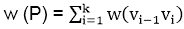
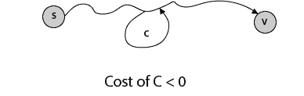

# 单源最短路径

> 原文：<https://www.javatpoint.com/single-source-shortest-paths>

## 导言:

在一个**最短路径问题**中，我们给出了一个加权的有向图 G = (V，E)，权重函数 **w: E → R** 将边映射到实值权重。路径 p 的重量= (v 0 ，v 1 ，.....v k 是其组成边的总重量:

我们用δ(u，v) = min (w (p): u→v 定义从 u 到 v 的最短路径权，如果有从 u 到 v 的路径，则δ(u，v)= ∞，否则。

然后将从顶点 s 到顶点 t 的**最短路径**定义为权重 w (p) = δ(s，t)的任意路径 p。

**广度优先搜索算法**是在未加权图上工作的最短路径算法，即每条边都可以被认为具有单位权重的图。

在一个**单源最短路径问题**中，我们给出了一个图 G = (V，E)，我们想要找到从给定的源顶点 s ∈ V 到每个顶点 v ∈ V 的最短路径。

## 变体:

最短路径问题有一些变体。

*   **单目的最短路径问题:**从每个顶点 v 寻找到给定目的顶点 t 的最短路径，通过移动图中每条边的方向，我们可以将这个问题缩短为单源问题。
*   **单对最短路径问题:**对于给定的顶点 u 和 v，求 u 到 v 的最短路径，如果我们用源顶点 u 来确定单源问题，我们也澄清了这个问题。此外，在最坏的情况下，没有一种算法比最好的单源算法运行得更快。
*   **全对最短路径问题:**为每对顶点 u 和 v 寻找从 u 到 v 的最短路径，从每个顶点运行一次单源算法可以澄清这个问题；但它通常可以更快地解决，而且它的结构本身也很有趣。

## 最短路径:存在:

如果从 s 到 v 的某条路径包含负成本周期，那么不存在最短路径。否则，存在一个简单的最短 s - v。

