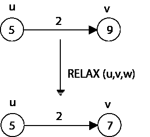
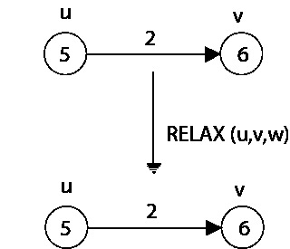

# 放松

> 原文：<https://www.javatpoint.com/relaxation>

单源最短路径基于一种称为**松弛**的技术，这是一种重复降低每个顶点的实际最短路径权重的上限，直到上限等于最短路径权重的方法。对于每个顶点 v ∈ V，我们维护一个属性 d [v]，它是从源 s 到 V 的最短路径权重的上限。我们称 d [v]为**最短路径估计**。

```
INITIALIZE - SINGLE - SOURCE (G, s)
 1\. for each vertex v ∈ V [G]
 2\. do d [v] ← ∞
 3\. π [v] ← NIL
 4\. d [s] ← 0

```

初始化后，所有 v ∈ V 的π [v] = NIL，v = s 的 d [v] = 0，v ∈ V - {s}的 d [v] = ∞。

放松边(u，v)的开发包括测试我们是否可以通过遍历 u 来改进到 v 的最短路径，如果可以，更新 d [v]和π [v]。松弛步骤可以降低最短路径估计 d [v]和更新的 v 的前置场π [v]的值。

图:用权重 w (u，v) = 2 松弛边(u，v)。每个顶点的最短路径估计出现在顶点内。



**(a)因为在松弛之前 v. d > u. d + w (u，v)，v. d 的值减小**



**(b)这里，v. d < u. d + w (u，v)在放松边缘之前，所以放松步骤保持 v. d 不变。**

后续代码在边沿(u，v)执行松弛步骤

```
RELAX (u, v, w)
 1\. If d [v] > d [u] + w (u, v)
 2\. then d [v] ← d [u] + w (u, v)
 3\. π [v] ← u

```