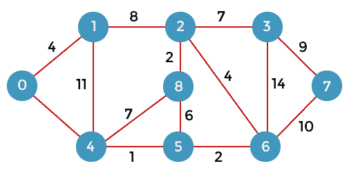
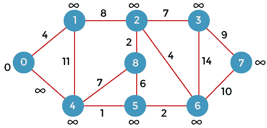
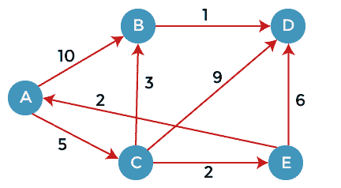

# 迪克斯特拉算法

> 原文：<https://www.javatpoint.com/dijkstras-algorithm>

Dijkstra 算法是一种单源最短路径算法。在这里，单源意味着只给定一个源，我们必须找到从源到所有节点的最短路径。

**我们来了解一下 Dijkstra 算法的工作原理。考虑下图。**



首先，我们必须考虑任何一个顶点作为源顶点。假设我们将顶点 0 视为源顶点。

这里我们假设 0 为源顶点，到所有其他顶点的距离为无穷大。最初，我们不知道距离。首先，我们将找出与顶点 0 直接相连的顶点。从上图中我们可以观察到，两个顶点直接连接到顶点 0。



让我们假设顶点 0 用“x”表示，顶点 1 用“y”表示。顶点之间的距离可以通过以下公式计算:

**d(x，y) = d(x) + c(x，y) < d(y)**

=**(0+4)**<ⅲ

=**4**<ⅲ

从 4

因此，我们得出结论，计算顶点之间距离的公式:

**{if( d(u) + c(u，v)<d(v)**

**d(v) = d(u) +c(u，v) }**

现在我们认为顶点 0 与“x”相同，顶点 4 与“y”相同。

**d(x，y) = d(x) + c(x，y) < d(y)**

=**(0+8)**<ⅲ

=**8**<ⅲ

因此，d(y)的值为 8。我们用值 4 和 8 分别替换顶点 1 和 4 的无穷大值。现在，我们已经找到了从顶点 0 到 1 和 0 到 4 的最短路径。因此，选择顶点 0。现在，我们将比较除顶点 0 以外的所有顶点。因为顶点 1 具有最低值，即 4；因此，选择顶点 1。

由于选择了顶点 1，因此我们考虑从 1 到 2 以及 1 到 4 的路径。我们不会考虑从 1 到 0 的路径，因为顶点 0 已经被选中。

首先，我们计算顶点 1 和 2 之间的距离。考虑顶点 1 为“x”，顶点 2 为“y”。

**d(x，y) = d(x) + c(x，y) < d(y)**

=**(4+8)**<ⅲ

=**12**<ⅲ

从 12 岁开始

现在，我们计算顶点 1 和顶点 4 之间的距离。将顶点 1 视为“x”，将顶点 4 视为“y”。

**d(x，y) = d(x) + c(x，y) < d(y)**

**= (4 + 11) < 8**

**= 15 < 8**

由于 15 不小于 8，因此我们不会将值 d(4)从 8 更新为 12。

到目前为止，已经选择了两个节点，即 0 和 1。现在我们必须比较除节点 0 和 1 之外的节点。节点 4 具有最小距离，即 8。因此，选择顶点 4。

由于选择了顶点 4，所以我们将考虑从顶点 4 开始的所有直接路径。从顶点 4 到 0、4 到 1、4 到 8 和 4 到 5 的直接路径。因为顶点 0 和 1 已经被选择，所以我们将不考虑顶点 0 和 1。我们将只考虑两个顶点，即 8 和 5。

首先，我们考虑顶点 8。首先，我们计算顶点 4 和 8 之间的距离。考虑顶点 4 为“x”，顶点 8 为“y”。

**d(x，y) = d(x) + c(x，y) < d(y)**

**=**(8+7)**<**

=**15**<ⅲ

由于 15 小于无穷大，所以我们将 d(8)从无穷大更新为 15。

现在，我们考虑顶点 5。首先，我们计算顶点 4 和 5 之间的距离。考虑顶点 4 为“x”，顶点 5 为“y”。

**d(x，y) = d(x) + c(x，y) < d(y)**

=**(8+1)**<ⅲ

=**9**<ⅲ

由于 5 小于无穷大，我们将 d(5)从无穷大更新为 9。

到目前为止，已经选择了三个节点，即 0、1 和 4。现在我们必须比较除节点 0、1 和 4 之外的节点。节点 5 具有最小值，即 9。因此，选择顶点 5。

由于选择了顶点 5，所以我们将考虑从顶点 5 开始的所有直接路径。从顶点 5 到 8 和 5 到 6 的直接路径。

首先，我们考虑顶点 8。首先，我们计算顶点 5 和 8 之间的距离。考虑顶点 5 为“x”，顶点 8 为“y”。

**d(x，y) = d(x) + c(x，y) < d(y)**

**= (9 + 15) < 15**

**= 24 < 15**

因为 24 不小于 15，所以我们不会将值 d(8)从 15 更新为 24。

现在，我们考虑顶点 6。首先，我们计算顶点 5 和 6 之间的距离。考虑顶点 5 为“x”，顶点 6 为“y”。

**d(x，y) = d(x) + c(x，y) < d(y)**

=**(9+2)**<ⅲ

=**11**<ⅲ

由于 11 小于无穷大，我们将 d(6)从无穷大更新为 11。

到目前为止，已经选择了节点 0、1、4 和 5。我们将比较除所选节点之外的节点。与其他节点相比，节点 6 具有最低值。因此，选择顶点 6。

由于选择了顶点 6，我们考虑从顶点 6 开始的所有直接路径。从顶点 6 到 2，6 到 3，6 到 7 的直接路径。

首先，我们考虑顶点 2。考虑顶点 6 为“x”，顶点 2 为“y”。

d(x，y) = d(x) + c(x，y) < d(y)

= (11 + 4) < 12

= 15 < 12

由于 15 不小于 12，我们不会将 d(2)从 12 更新为 15

现在我们考虑顶点 3。考虑顶点 6 为“x”，顶点 3 为“y”。

d(x，y) = d(x) + c(x，y) < d(y)

= (11 + 14) < ∞

= 25 < ∞

由于 25 小于∨，所以我们将 d(3)从∨更新为 25。

现在我们考虑顶点 7。考虑顶点 6 为“x”，顶点 7 为“y”。

d(x，y) = d(x) + c(x，y) < d(y)

= (11 + 10) < ∞

= 22 < ∞

由于 22 小于∞所以，我们将 d(7)从∞更新为 22。

到目前为止，已经选择了节点 0、1、4、5 和 6。现在我们必须比较所有未访问的节点，即 2、3、7 和 8。因为节点 2 具有最小值，即所有其他未访问节点中的 12 个。因此，选择了节点 2。

因为选择了节点 2，所以我们考虑从节点 2 开始的所有直接路径。从节点 2 到 8、2 到 6 和 2 到 3 的直接路径。

首先，我们考虑顶点 8。将顶点 2 视为“x”，将顶点 8 视为“y”。

d(x，y) = d(x) + c(x，y) < d(y)

= (12 + 2) < 15

= 14 < 15

由于 14 小于 15，我们将 d(8)从 15 更新为 14。

现在，我们考虑顶点 6。将顶点 2 视为“x”，将顶点 6 视为“y”。

d(x，y) = d(x) + c(x，y) < d(y)

= (12 + 4) < 11

= 16 < 11

由于 16 不小于 11，因此我们不会将 d(6)从 11 更新为 16。

现在，我们考虑顶点 3。将顶点 2 视为“x”，将顶点 3 视为“y”。

d(x，y) = d(x) + c(x，y) < d(y)

= (12 + 7) < 25

= 19 < 25

由于 19 小于 25，我们将 d(3)从 25 更新为 19。

到目前为止，已经选择了节点 0、1、2、4、5 和 6。我们比较所有未访问的节点，即 3、7 和 8。在节点 3、7 和 8 中，节点 8 具有最小值。直接连接到节点 8 的节点是 2、4 和 5。因为所有直接连接的节点都被选中，所以我们不会考虑任何节点进行更新。

未访问的节点是 3 和 7。在节点 3 和 7 中，节点 3 具有最小值，即 19。因此，选择节点 3。直接连接到节点 3 的节点是 2、6 和 7。由于已经选择了节点 2 和 6，因此我们将考虑这两个节点。

现在，我们考虑顶点 7。将顶点 3 视为“x”，将顶点 7 视为“y”。

d(x，y) = d(x) + c(x，y) < d(y)

= (19 + 9) < 21

= 28 < 21

由于 28 不小于 21，所以我们不会将 d(7)从 28 更新为 21。

**我们来考虑有向图。**



这里，我们考虑 A 作为源顶点。一个顶点是一个源顶点，因此条目填充为 0，而其他顶点填充为∞。源顶点到源顶点的距离为 0，源顶点到其他顶点的距离为∞。

我们将使用下表解决这个问题:

| A | B | C | D | E |
| ∞ | ∞ | ∞ | ∞ | ∞ |

由于 0 是上表中的最小值，所以我们选择顶点 A 并添加到如下所示的第二行:

|  | A | B | C | D | E |
| A | Zero | ∞ | ∞ | ∞ | ∞ |

正如我们在上面的图中可以观察到的，有两个顶点直接连接到顶点 A，即 B 和 c，顶点 A 没有直接连接到顶点 E，即边是从 E 到 A，这里我们可以计算两个距离，即从 A 到 B 和从 A 到 c，将使用与上一个问题中相同的公式。

```

If(d(x) + c(x, y)  < d(y))
  Then we update d(y) = d(x) + c(x, y)  

```

|  | A | B | C | D | E |
| A | Zero | ∞ | ∞ | ∞ | ∞ |
|  |  | Ten | five | ∞ | ∞ |

正如我们在第三行中观察到的，5 是最低值，因此顶点 C 将被添加到第三行中。

我们已经计算了顶点 B 和 C 距离 a 的距离，现在我们将比较顶点，找到值最低的顶点。由于顶点 C 具有最小值，即 5，因此将选择顶点 C。

由于选择了顶点 C，所以我们考虑从顶点 C 开始的所有直接路径，从顶点 C 开始的直接路径是 C 到 B，C 到 D，C 到 e。

首先，我们考虑顶点 B。我们计算从 C 到 B 的距离。将顶点 C 视为“x”，将顶点 B 视为“y”。

d(x，y) = d(x) + c(x，y) < d(y)

= (5 + 3) < ∞

= 8 < ∞

因为 8 小于无穷大，所以我们将 d(B)从∞更新为 8。现在将插入新行，其中值 8 将添加到 B 列下。

|  | A | B | C | D | E |
| A | Zero | ∞ | ∞ | ∞ | ∞ |
|  |  | Ten | five | ∞ | ∞ |
|  |  | eight |  |  |  |

我们考虑顶点 D。我们计算从 C 到 D 的距离。考虑顶点 C 为‘x’，顶点 D 为‘y’。

d(x，y) = d(x) + c(x，y) < d(y)

= (5 + 9) < ∞

= 14 < ∞

由于 14 小于无穷大，所以我们将 d(D)从∞更新为 14。值 14 将被添加到 D 列下。

|  | A | B | C | D | E |
| A | Zero | ∞ | ∞ | ∞ | ∞ |
| C |  | Ten | five | ∞ | ∞ |
|  |  | eight |  | Fourteen |  |

我们考虑顶点 E。我们计算从 C 到 E 的距离。考虑顶点 C 为‘x’，顶点 E 为‘y’。

d(x，y) = d(x) + c(x，y) < d(y)

= (5 + 2) < ∞

= 7 < ∞

由于 14 小于无穷大，所以我们将 d(D)从∞更新为 14。值 14 将被添加到 D 列下。

|  | A | B | C | D | E |
| A | Zero | ∞ | ∞ | ∞ | ∞ |
| C |  | Ten | five | ∞ | ∞ |
|  |  | eight |  | Fourteen | seven |

如上表所示，7 是 8、14 和 7 中的最小值。因此，顶点 E 被添加到左侧，如下表所示:

|  | A | B | C | D | E |
| A | Zero | ∞ | ∞ | ∞ | ∞ |
| C |  | Ten | five | ∞ | ∞ |
| E |  | eight |  | Fourteen | seven |

选择顶点 E，因此我们考虑从顶点 E 开始的所有直接路径。从顶点 E 开始的直接路径是 E 到 A 和 E 到 d。由于选择了顶点 A，因此我们将不考虑从 E 到 A 的路径。

**考虑从 E 到 d 的路径**

d(x，y) = d(x) + c(x，y) < d(y)

= (7 + 6) < 14

= 13 < 14

由于 13 小于无穷大，所以我们将 d(D)从∞更新为 13。值 13 将被添加到 D 列下。

|  | A | B | C | D | E |
| A | Zero | ∞ | ∞ | ∞ | ∞ |
| C |  | Ten | five | ∞ | ∞ |
| E |  | eight |  | Fourteen | seven |
| B |  | eight |  | Thirteen |  |

值 8 是 8 和 13 之间的最小值。因此，选择顶点 B。从 B 到 d 的直接路径是 B。

d(x，y) = d(x) + c(x，y) < d(y)

= (8 + 1) < 13

= 9 < 13

因为 9 小于 13，所以我们将 d(D)从 13 更新为 9。值 9 将被添加到 D 列下。

|  | A | B | C | D | E |
| A | Zero | ∞ | ∞ | ∞ | ∞ |
| C |  | Ten | five | ∞ | ∞ |
| E |  | eight |  | Fourteen | seven |
| B |  | eight |  | Thirteen |  |
| D |  |  |  | nine |  |

* * *