# 弗洛伊德-沃肖尔算法

> 原文：<https://www.javatpoint.com/floyd-warshall-algorithm>

设 G 的顶点为 V = {1，2........n}并考虑子集{1，2........对于任意一对顶点 I，j ∈ V，考虑中间顶点都是从{1，2 }画出的从 I 到 j 的所有路径.......k}，让 p 是其中的最小权重路径。Floyd-Warshall 算法利用路径 p 和从 I 到 j 的最短路径与集合{1，2.......k-1}。该链接取决于 k 是否是路径 p 的中间顶点。

如果 k 不是路径 p 的中间顶点，那么路径 p 的所有中间顶点都在集合{1，2........k-1}。因此，从顶点 I 到具有集合{1，2 }中所有中间顶点的顶点 j 的最短路径.......k-1}也是集合{1，2 }中所有中间顶点的最短路径 I 到 j.......k}。

如果 k 是路径 p 的中间顶点，那么我们把 p 分解成 i → k → j。

设 d <sub>ij</sub> <sup>(k)</sup> 为集合{1，2 }中所有中间顶点从顶点 I 到顶点 j 的最短路径的权重.......k}。

递归定义由下式给出

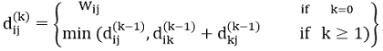

```
FLOYD - WARSHALL (W)
 1\. n ← rows [W].
 2\. D0 ← W
 3\. for k ← 1 to n
 4\. do for i ← 1 to n     
 5\. do for j ← 1 to n     
 6\. do dij(k) ← min (dij(k-1),dik(k-1)+dkj(k-1) )
 7\. return D(n)      

```

弗洛伊德-沃肖尔算法采用的策略是**动态规划**。弗洛伊德-沃肖尔算法的运行时间由第 3-6 行循环的三重嵌套决定。第 6 行的每次执行需要 0(1)时间。因此，该算法在时间θ(n <sup>3</sup> 内运行。

**示例:**应用 Floyd-Warshall 算法构造最短路径。显示由图的弗洛伊德-沃肖尔算法计算的矩阵 D <sup>(k)</sup> 和π <sup>(k)</sup> 。

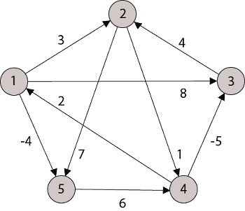

**解决方案:**

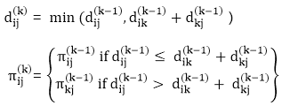

**步骤(i)** 当 k = 0 时

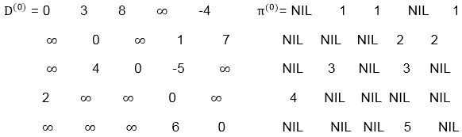

**步骤(ii)** 当 k =1 时

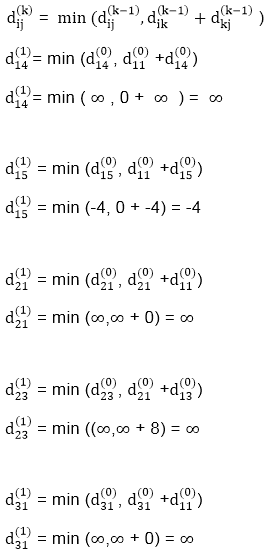
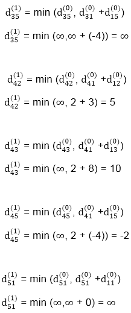
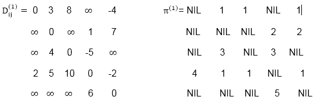

**步骤(iii)** 当 k = 2 时


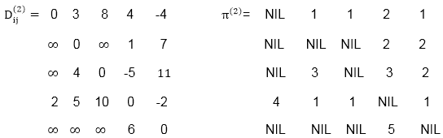

**步骤(iv)** 当 k = 3 时

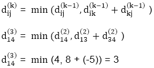
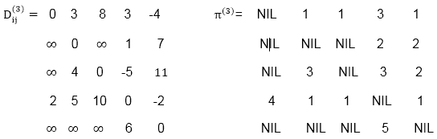

当 k = 4 时，步骤(v)

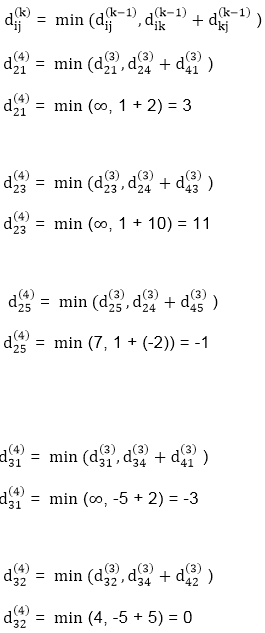
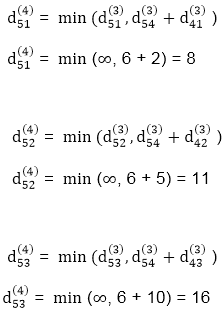
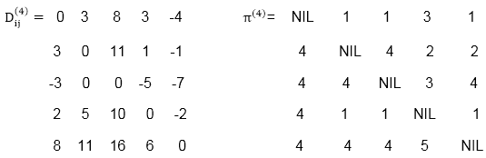

**当 k = 5 时，步骤(vi)**

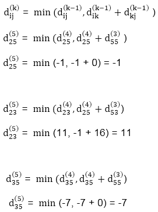
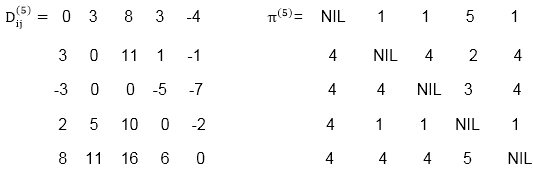

```
TRANSITIVE- CLOSURE (G)
 1\. n ← |V[G]|
 2\. for i ← 1 to n
 3\. do for j ← 1 to n
 4\. do if i = j or (i, j) ∈ E [G]
 5\. the ← 1
 6\. else ← 0
 7\. for k ← 1 to n
 8\. do for i ← 1 to n
 9\. do for j ← 1 to n
 10\. dod ij(k) ← 
 11\. Return T(n).

```