# 约翰逊算法

> 原文：<https://www.javatpoint.com/johnsons-algorithm>

问题是在给定的加权有向图中找到每对顶点之间的最短路径，权重可能是负的。利用约翰逊算法，我们可以在 O (V <sup>2</sup> 日志中找到所有对最短路径？V+VE)时间。约翰逊算法同时使用了迪克斯特拉算法和贝尔曼-福特算法。

约翰逊算法使用**“重新加权”的技术**如果一个图 G = (V，E)中的所有边权 w 都是非负的，我们可以通过从每个顶点运行一次 Dijkstra 算法来找到所有顶点对之间的最短路径。如果 G 有负权重的边，我们计算一组新的非负边权重，允许我们使用相同的方法。新的边权重 w 集合必须满足两个基本属性:

1.  对于所有顶点对 u，v ∈ V，使用权函数 w 从 u 到 V 的最短路径也是使用权函数 w 从 u 到 V 的最短路径。
2.  对于所有边(u，v)，新的权重 w (u，v)是非负的。

给定一个加权有向图 G = (V，E)，权函数 w: E→R，设 h: v→R 为任意将顶点映射为实数的函数。

对于每条边(u，v) ∈ E 定义

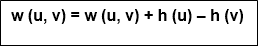

其中 h(u)= u 的标号
h(v)= v 的标号

```
JOHNSON (G)
 1\. Compute G' where V [G'] = V[G] ∪ {S} and
E [G'] = E [G] ∪ {(s, v): v ∈ V [G] }

 2\. If BELLMAN-FORD (G',w, s) = FALSE
    then "input graph contains a negative weight cycle"
  else
    for each vertex v ∈ V [G']
     do h (v) ← δ(s, v)
  Computed by Bellman-Ford algorithm
 for each edge (u, v) ∈ E[G']
   do w (u, v) ← w (u, v) + h (u) - h (v)
 for each edge u ∈ V [G]
 do run DIJKSTRA (G, w, u) to compute
    δ (u, v) for all v ∈ V [G]
  for each vertex v ∈ V [G]
 do duv← δ (u, v) + h (v) - h (u)
Return D.

```

**示例:**

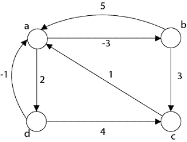

**步骤 1:** 取图外的任意一个源顶点，并计算从到每个顶点“0”的距离。

**步骤 2:** 应用贝尔曼-福特算法，计算每个顶点的最小权重。

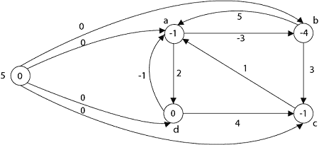

**第三步:** w (a，b) = w (a，b)+h(a)-h(b)
=-3+(-1)-(4)
= 0

w (b，a) = w (b，a)+h(b)-h(a)
= 5+(-4)-(1)
= 2
w(b，c) = w (b，c) + h (b) - h (c)
w (b，c)= 3+(-4)-(1)
= 0
w(c) c) = w (d，c) + h (d) - h (c)
w (d，c) = 4 + 0 - (-1)
= 5
w (d，a) = w (d，a) + h (d) - h (a)
w (d，a)= = 1+0-(-1)
w(a，d)= 0

**第四步:**现在所有的边权重都是正的，现在我们可以在每个顶点上应用 Dijkstra 算法，并使一个矩阵对应于图中的每个顶点

**情况 1:**“a”作为源顶点


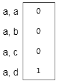

**情况 2:**“b”作为源顶点

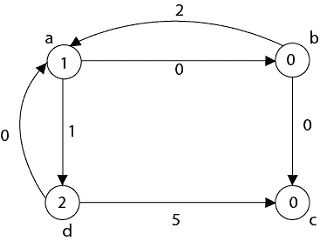
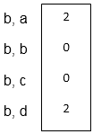

**情况 3:**‘c’作为源顶点

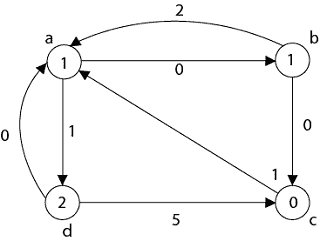
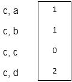

**案例 4:**“d”作为源顶点

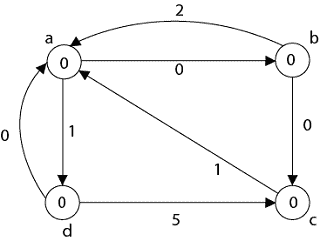
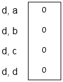
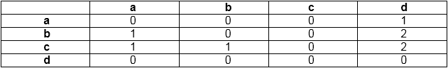

**第五步:**

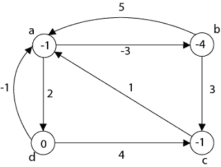

d <sub>紫外线</sub> ← δ (u，v) + h (v) - h (u)
d (a，a)= 0+(-1)-(1)= 0
d(a，b)= 0+(-4)-(1)=(3)
d(a，c)= 0+(-1)-(1)= 0
b)= 0+(-4)-(4)= 0
d(c，a)= 1+(-1)-(1)= 1
d(c，b)= 1+(-4)-(1)=–2
d(c，c)= 0
d(c，d)= 2+(0)-(1)= 3
d(d，a) = 0 + (-1)

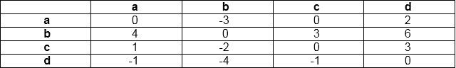