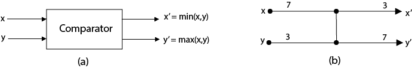
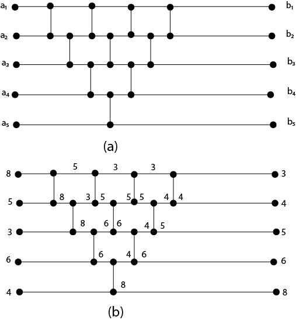

# 比较网络

> 原文：<https://www.javatpoint.com/daa-comparison-network>

比较网络由导线和比较器组成。一个**比较器**是一个有两个输入，x 和 y，和两个输出，x '和 y '的设备，其中

x'=最小值(x，y)
y' =最大值(x，y)

在比较网络中，输入出现在左侧，输出出现在右侧，最小的输入值出现在顶部输出，最大的输入值出现在底部输出。每个比较器在 0(1)时间内工作。换句话说，我们认为输入值 x 和 y 的出现与输出值 x’和 y’的产生之间的时间是一个常数。

电线把一个值从一个地方传到另一个地方。一个比较网络包含 n 条输入线 a 1 ，a 2 ，........a n 待分拣福利通过其进入网络，n 输出线 b 1 ，b 2 ，......b n ，产生网络计算的结果。

比较网络是一组通过导线互连的比较器。比较器的运行时间可以定义为**深度**。

**导线深度:**比较网络的输入导线深度为 0。现在，如果一个比较器有两条深度为 d x 和 d y 的输入线，那么它的输出线的深度最大值(d x ，d y ) + 1。

排序网络是输出序列单调递增的比较网络(即 b 1 ≤ b 2 ≤....b n )为每个输入序列。

**图:基于插入排序的排序网络**

