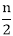
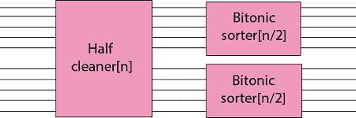

# 双离子分选网络

> 原文：<https://www.javatpoint.com/daa-bitonic-sorting-network>

单调增加然后单调减少的序列，或者单调减少然后单调增加的序列被称为比特序列。例如:序列(2，5，6，9，3，1)和(8，7，5，2，4，6)都是双音素的。二进制排序器是一个比较网络，用于对 0 和 1 的二进制序列进行排序。

**半清洗器:**一个双离子分拣机包含几个阶段，每个阶段被称为半清洗器。每个半清洁器是深度为 1 的比较网络，其中输入线 I 与线 1+ 进行比较，i = 1，2.....。

当 0 和 1 的二进制序列被用作半清除器的输入时，半清除器产生一个输出序列，其中较小的值在上半部分，较大的值在下半部分，并且两个半部分都是二进制的，并且至少一个半部分是干净的。

**双音素排序器:**通过递归连接半清除器，我们可以构建一个双音素排序器，这是一个对双音素序列进行排序的网络。BITONIC-SORTER [n]的第一级由 HALF-CLEANER [n]组成，它产生两个一半大小的 BITONIC 序列，这样上半部分的每个元素至少和下半部分的每个元素一样小。因此，我们可以通过利用 BITONIC-SORTER [n/2]的两个副本递归地对这两半进行排序来完成排序。

**图:BITONIC-SORTER [n]的深度 D (n)由递推给出，其解为 D (n) = log n.**

