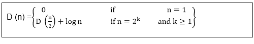

# 合并网络

> 原文：<https://www.javatpoint.com/daa-merging-network>

合并网络是可以将两个排序的输入序列连接成一个排序的输出序列的网络。我们采用 BITONIC-SORTER [n]来创建合并网络 MERGE[n]。

合并网络基于以下假设:

给定两个排序的序列，如果我们颠倒第二个序列的顺序，然后连接这两个序列，得到的序列是双音素的。

例如:给定两个排序过的零一序列 X = 00000111 和 Y =00001111，我们反 Y 得到 Y R = 11110000。连接 X 和 Y R 得到 000001111110000，这是双调和的。

排序网络 SORTER [n]需要合并网络来实现并行版本的合并排序。SORTER [n]的第一阶段由 MERGE[2]的 n/2 个副本组成，这些副本并行工作以合并 1 元素序列的对，从而产生长度为 2 的排序序列。第二阶段由 n/4 个 MERGE[4]拷贝组成，合并这些 2 元排序序列对，生成长度为 4 的排序序列。一般来说，对于 k = 1，2.....log n，阶段 k 由合并[2 ]k的 n/2k个副本组成，这些副本合并成对的 2k1 元素排序序列，以产生长度为 2k的排序序列。在最后一个阶段，产生一个由所有输入值组成的排序序列。这种排序网络可以通过归纳法对零一序列进行排序来表示，因此通过零一原理，它可以对任意值进行排序。

给定 SORTER [n]深度的递归

其解为 D (n) = θ(对数 2 n)。因此，我们可以在ₒ (log 2 n)时间内并行排序 n 个数字。