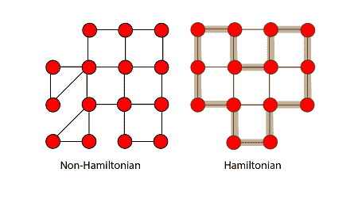
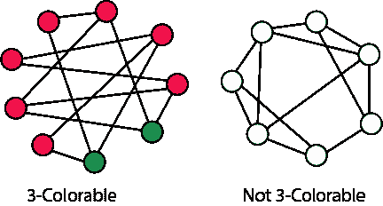

# 多项式时间验证

> 原文：<https://www.javatpoint.com/daa-polynomial-time-verification>

在讨论 NP 完全问题之前，有必要引入验证算法的概念。

许多问题很难解决，但是它们具有这样的特性:如果提供了解决方案，就很容易对其进行身份验证。

## 哈密顿圈问题:-

考虑哈密顿圈问题。给定一个无向图 G，G 是否有一个恰好访问每个顶点一次的循环？对于这个争议，目前还没有已知的多项式时间算法。

#### 注:-这意味着即使没有给定特定顶点的哈密顿圈的具体路径，也不能在多项式时间的图中建立哈密顿圈，但不能在多项式时间内验证哈密顿圈

**图:哈密顿圈**

让我们理解一个图确实有一个哈密顿圈。有人很容易相信这一点。他们会类似地说:“周期是 hv3，v7，v1....v13i。

然后，我们可以检查该图，并检查这是否确实是一个合法的循环，以及它是否恰好访问了该图的所有顶点一次。因此，即使我们不知道解决哈密顿圈问题的有效方法，也有一种有益的方法来验证给定的圈确实是哈密顿圈。

#### 注:-对于无向哈密顿圈图 g 在多项式时间内的验证，必须给出哈密顿圈的精确/特定/确定路径，然后才能在多项式时间内进行验证。

**证书的定义:** -顶点的给定路径中包含的一条信息称为证书

## P 类与 NP 类的关系

1.  NP 中包含 p
2.  P=NP

1.  观察 NP 中含有 P。换句话说，如果我们能在多项式时间内解决一个问题，我们确实可以在多项式时间内验证解。更正式地说，我们不需要看到证书(不需要指定特定路径的顶点/中间点)来解决问题；反正我们可以用多项式时间来解释。
2.  然而，不知道 P = NP 是否成立。看起来你可以在多项式时间内验证并产生一组 NP 类中基于决策的问题的输出，这是不可能的，因为根据 NP 类的定义，你可以在多项式时间内验证解。所以这种关系永远不能成立。

## 削减:

类 NP 完全(NPC)问题由一组没有人知道如何有效解决的决策问题(类 NP 的子集)组成。但是如果一个 NP 完全问题有多项式解，那么 NPC 的每个问题都可以在多项式时间内求解。为此，我们需要削减的概念。

假设有两个问题，A 和 b，你知道不可能在多项式时间内解决问题 A。你想证明 B 不能用多项式时间解释。我们想证明(a∉p)=(b∉p)

考虑一个例子来说明简化:下面的问题是众所周知的 NPC:

**3 色:**给定一个图 G，它的每个顶点是否可以用 3 种不同颜色中的一种来标记，使得两个相邻的顶点不具有相同的标记(颜色)。

着色出现在各种分区问题中，其中存在两个对象不能被分配给同一组分区的约束。短语“着色”来自地图绘制中的原始应用。有共同边界的两个国家应该用不同的颜色来着色。

众所周知，平面图可以用四种颜色着色(映射)。对此存在多项式时间算法。但是决定这是否可以用 3 种颜色来完成是很难的，并且没有多项式时间算法。

**图:3-可着色和不 3-可着色图的例子。**

## 多项式时间缩减:

我们说决策问题 L 1 是多项式时间可约化为决策问题 L2(L1≤pL2)如果有多项式时间计算函数 f 使得所有的 x，x &都是直的；L 1 当且仅当 x &伸直；L 2 。