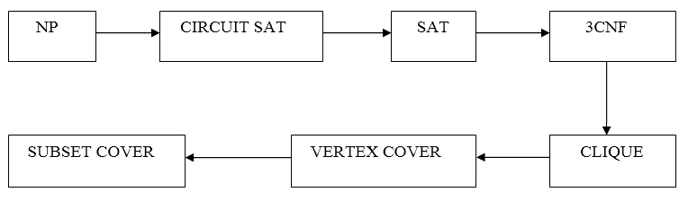

# NP-完全性

> 原文：<https://www.javatpoint.com/daa-np-completeness>

一个决策问题 L 是 NP-Hard if

所有 L' &straightepsilon; NP 的 L' ≤p L。

**定义:** L 是 NP-完全的，如果

1.  L &straightepsilon; NP 和
2.  L’≤p L 对于一些已知的 NP 完全问题 L’，给定这个形式定义，复杂度类是:

**P:** 是多项式时间内可解的决策问题集。

**NP:** 是可以在多项式时间内验证的决策问题集。

**NP-Hard:** L 为 NP-Hard，若为所有 L' &拉直；因此，如果我们能在多项式时间内解决 L，我们就能在多项式时间内解决所有的 NP 问题。

**NP-Complete** L 是 NP-Complete，如果

1.  L &straightepsilon; NP 和
2.  l 是 NP 难的

如果任何一个 NP 完全问题在多项式时间内是可解的，那么每个 NP 完全问题在多项式时间内也是可解的。反之，如果我们能证明任何 NP-完全问题都不能在多项式时间内求解，那么每个 NP-完全问题都不能在多项式时间内求解。

## 减少

**概念:** -如果 NPC 问题的解不存在，那么在多项式时间内从一个 NPC 问题到另一个 NPC 问题的转换。为此，你需要还原的概念。如果一个 NPC 问题的解在多项式时间内存在，那么问题的其余部分也可以在多项式时间内给出解(但这很难相信)。为此，你需要还原的概念。

**例:** -假设有两个问题， **A** 和 **B** 。你知道不可能在多项式时间内解决问题 **A** 。你想证明 B 不能在多项式时间内求解。所以可以在多项式时间内将问题 **A** 转化为问题 **B** 。

## NP 完全问题的例子

**NP 问题:** -假设提供了一个基于决策的问题，其中一组输入/高输入可以获得高输出。

**标准以 NP-hard 或 NP-complete 形式出现。**

1.  这里要注意的一点是，输出已经给出，你可以在多项式时间内验证输出/解，但不能在多项式时间内产生输出/解。
2.  这里我们需要约简的概念，因为当你不能根据给定的输入产生问题的输出时，你必须强调约简的概念，在这种情况下，你可以将一个问题转化为另一个问题。

#### 注 1:-如果你满足这两点，那么你的问题就属于 NP 完全类

#### 注 2:-如果你只满足第二点，那么你的问题就属于 NP-hard 类

因此，根据给定的基于决策的 NP 问题，你可以以是或否的形式来决定。如果是，那么你必须进行验证，并通过约简概念转换成另一个问题。如果你被执行，那么两个基于决策的 NP 问题都在 NP 竞争中。

**这里我们要强调 NPC。**

