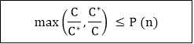

# 近似算法

> 原文：<https://www.javatpoint.com/daa-approximate-algorithms>

## 导言:

近似算法是解决优化问题的一种方法。这种技术不能保证最佳解决方案。近似算法的目标是在最多项式时间的合理时间内尽可能接近最佳值。这种算法称为近似算法或启发式算法。

*   对于旅行推销员问题，优化问题是寻找最短周期，近似问题是寻找短周期。
*   对于顶点覆盖问题，优化问题是寻找顶点最少的顶点覆盖，逼近问题是寻找顶点最少的顶点覆盖。

## 性能比率

假设我们处理一个优化问题，其中每个解决方案都有成本。近似算法返回合法的解决方案，但是该合法解决方案的成本可能不是最优的。

例如，假设我们正在考虑一个最小尺寸的顶点覆盖。一个近似算法为我们返回一个 VC，但是大小(成本)可能不会最小化。

另一个例子是我们正在考虑一个**最大尺寸独立集(IS)** 。近似算法为我们返回一个信息系统，但是大小(成本)可能不是最大的。设 C 为近似算法返回的解的代价，C&midast；是最优解的成本。

我们说近似算法对于输入大小 n 具有近似比率 P (n)，其中

直观地说，近似比衡量近似解与最优解的区别程度。一个大的(小的)近似比测量的解比一个最优解差得多(或多或少相同)。

观察到 P (n)总是≥ 1，如果比值不依赖于 n，我们可以写 P。因此，1-近似算法给出了一个最优解。一些问题具有小常数近似比的多项式时间近似算法，而另一些问题具有最著名的多项式时间近似算法，其近似比随着 n 的增加而增加。