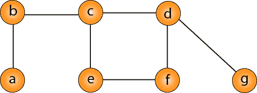
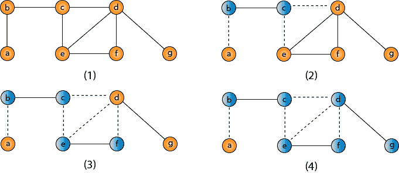

# 顶点覆盖

> 原文：<https://www.javatpoint.com/daa-approximation-algorithm-vertex-cover>

图 G 的顶点覆盖是一组顶点，使得 G 中的每条边都与这些顶点中的至少一个相关联。

决策顶点覆盖问题被证明为 NPC 问题。现在，我们想要解决顶点覆盖问题的最优版本，即，我们想要找到给定图的最小尺寸顶点覆盖。我们称这样的顶点覆盖为最优顶点覆盖 C &midast;。



顶点覆盖的近似算法；

```

Approx-Vertex-Cover (G = (V, E))
{           
       C = empty-set;
    E'= E;
    While E' is not empty do
      {
    Let (u, v) be any edge in E': (*)
    Add u and v to C;
    Remove from E' all edges incident to
       u or v;
      }
    Return C;
}

```

这个想法是一个接一个地取一条边(u，v)，把两个顶点都放在 C 上，去掉所有入射到 u 或 v 上的边，我们继续下去，直到所有的边都被去掉。c 是 VC。但是 C 有多好呢？



VC = {b，c，d，e，f，g}