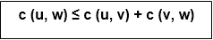
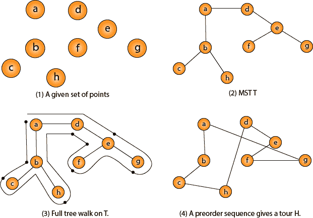

# 旅行推销员问题

> 原文：<https://www.javatpoint.com/daa-traveling-salesman-problem>

在旅行推销员问题中，推销员必须访问 n 个城市。我们可以说，推销员希望进行一次旅行或哈密尔顿循环，准确地访问每个城市一次，并在他开始的城市结束。从城市 I 到城市 j 有一个非负成本 c (i，j)，目标是找到一个最低成本的旅行。我们假设每两个城市是相连的。这类问题被称为旅行商问题。

我们可以将城市建模为由 n 个顶点组成的完整图形，其中每个顶点代表一个城市。

可以看出 TSP 就是 NPC。

如果我们假设成本函数 c 满足三角不等式，那么我们可以使用下面的近似算法。

## 三角形不等式

假设 u，v，w 是任意三个顶点，我们有



开发近似解决方案的一个重要观察结果是，如果我们从 H &midast;中移除一条边，那么这个旅程就变成了一棵生成树。

```

Approx-TSP (G= (V, E)) 
{
  1\. Compute a MST T of G;
  2\. Select any vertex r is the root of the tree;
  3\. Let L be the list of vertices visited in a preorder tree walk of T;
  4\. Return the Hamiltonian cycle H that visits the vertices in the order L;
}

```

**旅行推销员问题**



直观地说，近似 TSP 首先对 MST T 进行一次完整的行走，它正好访问每个边两次。为了从完整的行走中创建一个哈密尔顿循环，它绕过了一些顶点(这对应于走捷径)