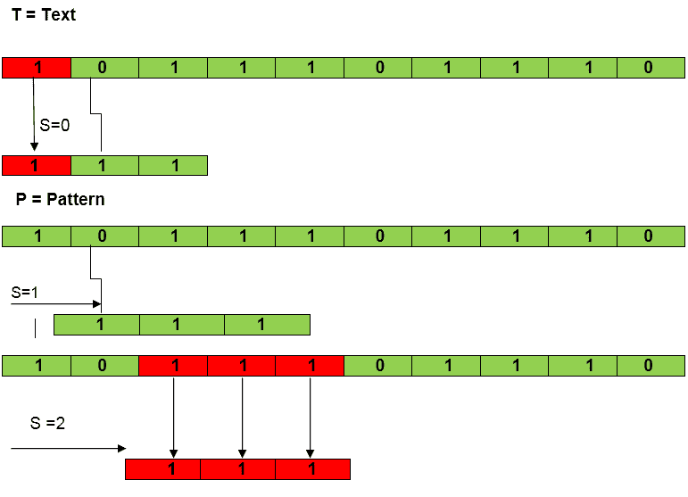
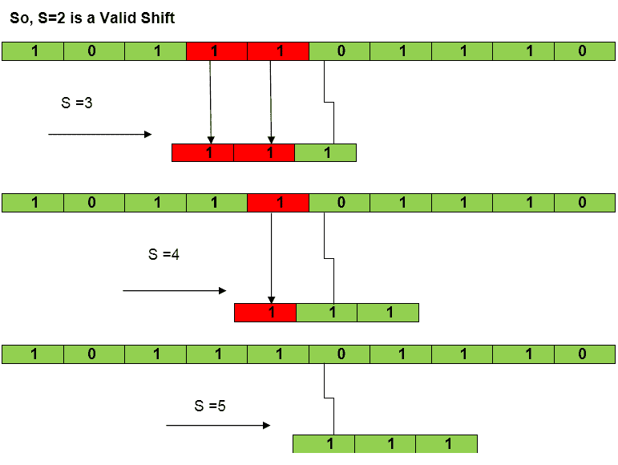
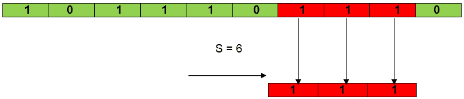
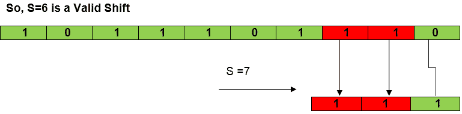

# 朴素字符串匹配算法

> 原文：<https://www.javatpoint.com/daa-naive-string-matching-algorithm>

天真的方法测试了模式 P[1]的所有可能的布局.......m]相对于文本 T [1......n]。我们尝试移位 s = 0，1.......n-m，连续进行，每个班次比较 T [s+1.......s+m]至 P [1......m]。

nave 算法使用检查条件 P[1]的循环来查找所有有效的移位.......m] = T [s+1.......对于 s 的 n - m +1 个可能值中的每一个。

```
NAIVE-STRING-MATCHER (T, P)
 1\. n ← length [T]
 2\. m ← length [P]
 3\. for s ← 0 to n -m
 4\. do if P [1.....m] = T [s + 1....s + m]
 5\. then print "Pattern occurs with shift" s

```

**分析:**这个 for 循环从 3 到 5 执行 n-m + 1 次(我们在末尾至少需要 m 个字符)，在迭代中我们进行 m 个比较。所以总复杂度是 O (n-m+1)。

### 示例:

```

Suppose T = 1011101110
        P = 111
       Find all the Valid Shift

```

**解决方案:**




