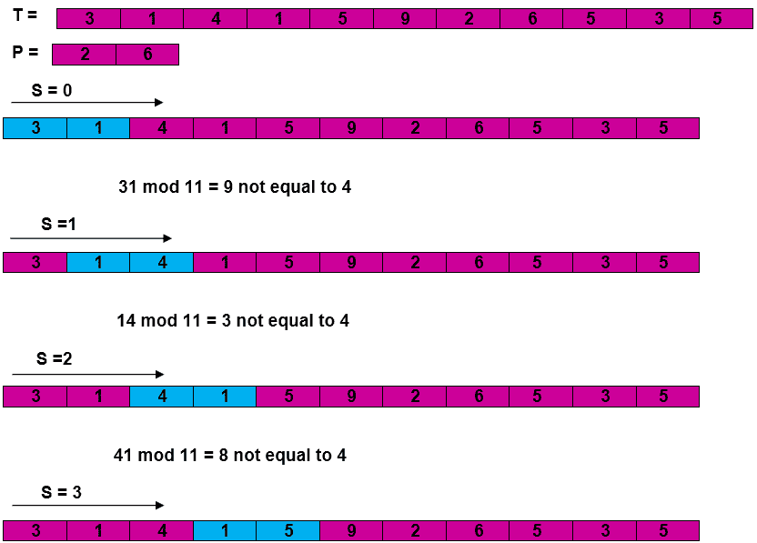
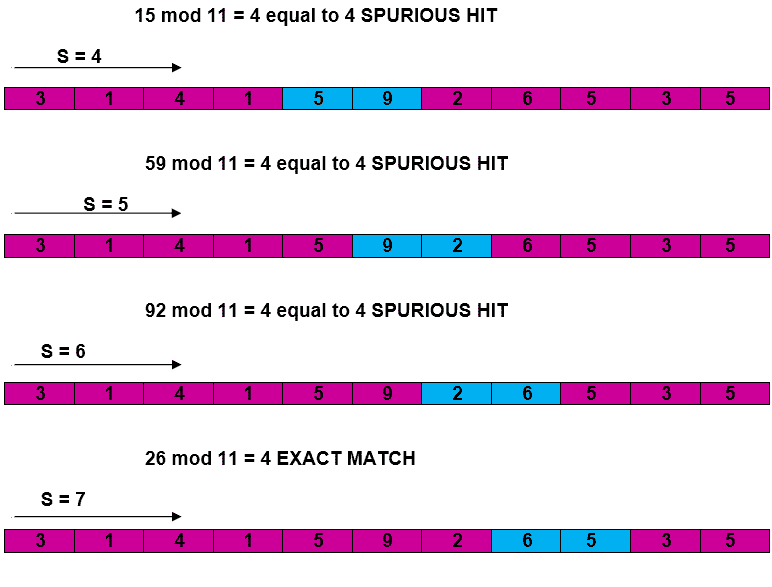
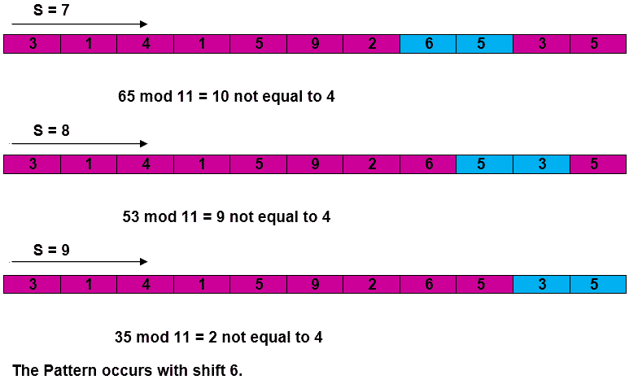

# 拉宾-卡普算法

> 原文：<https://www.javatpoint.com/daa-rabin-karp-algorithm>

拉宾-卡普字符串匹配算法计算模式的哈希值，以及待比较文本的每个 M 字符子序列的哈希值。如果哈希值不相等，算法将确定下一个 M 字符序列的哈希值。如果哈希值相等，算法将分析模式和 M 字符序列。这样，每个文本子序列只有一个比较，只有当哈希值匹配时才需要字符匹配。

```
RABIN-KARP-MATCHER (T, P, d, q)
 1\. n ← length [T]
 2\. m  ← length [P]
 3\. h  ←  dm-1 mod q
 4\. p ←  0
 5\. t0 ←  0
 6\. for i ← 1 to m
 7\. do p ←  (dp + P[i]) mod q
 8\. t0 ← (dt0+T [i]) mod q
 9\. for s  ←  0 to n-m
 10\. do if p = ts
 11\. then if P [1.....m] = T [s+1.....s + m]
 12\. then "Pattern occurs with shift" s
 13\. If s < n-m
 14\. then ts+1 ←  (d (ts-T [s+1]h)+T [s+m+1])mod q

```

**示例:**对于字符串匹配，工作模块 q = 11，Rabin-Karp 匹配器在 Text T = 31415926535 中遇到多少次虚假命中.......

```

  T = 31415926535.......
  P = 26
 Here T.Length =11 so Q = 11	
 And P mod Q = 26 mod 11 = 4
Now find the exact match of P mod Q...

```

**解决方案:**





## 复杂性:

**RABIN-KARP-MATCHER** 在最坏情况下的运行时间 **O ((n-m+1) m** 但是它有很好的平均情况运行时间。如果强移位的预期数量很小 **O (1)** 并且素数 q 被选择为相当大，那么拉宾-卡普算法可以预期在时间 **O (n+m)** 加上处理虚假命中所需的时间内运行。