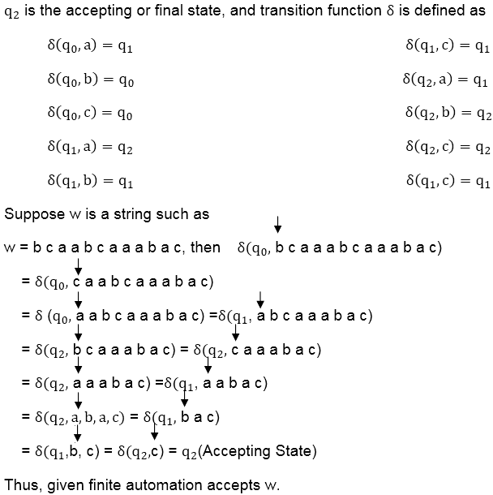

# 有限自动机的字符串匹配

> 原文：<https://www.javatpoint.com/daa-string-matching-with-finite-automata>

字符串匹配自动机是字符串匹配算法中非常有用的工具。它只检查文本中的每个字符一次，并报告 O (n)时间内的所有有效移位。字符串匹配的目标是在更大的文本(一个句子、一个段落、一本书等)中找到特定文本模式的位置。)

## 有限自动机:

有限自动机 **M** 是 5 元组 **(Q，q <sub>0</sub> ，A，∑ <sub>δ</sub> )** ，其中

*   q 是一组有限的**状态**，
*   q <sub>0</sub> ∈ Q 为**启动状态**，
*   ⊆ Q 是一组值得注意的接受状态，
*   ∑是一个**有限输入字母表**，
*   δ是从 **Q x ∑** 到 **Q** 的函数，称为 **M** 的**过渡函数**。

有限自动机从状态 **q <sub>0</sub>** 开始，一次读取一个输入字符串的字符。如果自动机处于状态 q 并读取输入字符 a，它将从状态 q 移动到状态δ (q，a)。每当其当前状态 q 是 A 的成员时，机器 M 已经接受了到目前为止读取的字符串。不允许的输入是**拒绝**。

一个有限自动机 m 归纳出一个叫做∅的函数，叫做**最终状态函数**，从∑*到 q，这样∅(w)就是 m 在扫描了字符串 w 之后结束的状态。因此，m 接受了一个字符串 w，当且仅当∅(w)a。

函数 f 定义为

```
∅ (∈)=q0
∅ (wa) = δ ((∅ (w), a) for w ∈ ∑*,a∈ ∑)

```

```
FINITE- AUTOMATON-MATCHER (T,δ, m),
 1\. n ← length [T]
 2\. q ← 0
 3\. for i ← 1 to n
 4\. do q ← δ (q, T[i]) 
 5\. If q =m
 6\. then s←i-m
 7\. print "Pattern occurs with shift s" s

```

有限自动机匹配器的主要循环结构意味着它在长度为 n 的文本串上的运行时间是 O (n)。

**计算转移函数:**以下程序根据给定的模式 P[1]计算转移函数δ......m]

```
COMPUTE-TRANSITION-FUNCTION (P, &Sum;)
 1\. m ← length [P]
 2\. for q ← 0 to m
 3\. do for each character a ∈ &Sum;*
 4\. do k ← min (m+1, q+2)
 5\. repeat k←k-1
 6\. Until
 7\. δ(q,a)←k
 8\. Return δ

```

**例:**假设一个有限自动机，它接受偶数个 a，其中&求和；= {a，b，c}


**解决方案:**

q <sub>0</sub> 为初始状态。

