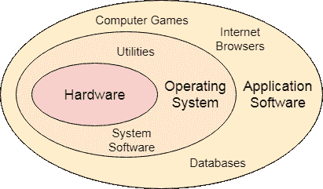
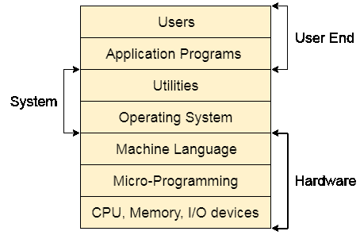

# 操作系统教程

> 吴奇珍:t0]https://www . javatppoint . com/OS-tutorial

操作系统教程提供了操作系统的基本和高级概念。我们的操作系统教程是为初学者、专业人士和 GATE 追求者设计的。我们在完成对每个概念的深入研究后，设计了本教程。

内容描述详细，能够回答您的大部分问题。本教程还包含基于前一年 GATE 问题的数值示例，这些示例将帮助您以实用的方式解决问题。

操作系统可以定义为用户和硬件之间的接口。它为用户提供了一个环境，以便用户可以方便有效地执行任务。

操作系统教程根据其功能分为不同的部分，如进程管理、进程同步、死锁和文件管理。

## 操作系统定义和功能

在计算机系统(由硬件和软件组成)中，硬件只能理解机器代码(以 0 和 1 的形式)，这对一个天真的用户来说没有任何意义。

我们需要一个能够充当中介并管理系统中所有进程和资源的系统。

一个**操作系统**可以定义为用户和硬件之间的一个**接口。它负责所有进程的执行、资源分配、[中央处理器](https://www.javatpoint.com/cpu-full-form)管理、文件管理和许多其他任务。**

操作系统的目的是提供一个环境，用户可以在其中以方便和有效的方式执行程序。

## 计算机系统的结构

计算机系统包括:

*   用户(使用计算机的人)
*   应用程序(编译器、数据库、游戏、视频播放器、浏览器等。)
*   系统程序(外壳、编辑器、编译器等)。)
*   操作系统(作为用户和硬件之间接口的特殊程序)
*   硬件(中央处理器、磁盘、内存等)

## 操作系统是做什么的？

1.  进程管理
2.  进程同步
3.  内存管理
4.  中央处理器调度
5.  文件管理
6.  安全

* * *

## 操作系统索引

* * *

**操作系统教程**

*   教程
*   [操作系统类型](types-of-os)

**流程管理**

*   [简介](os-process-management-introduction)
*   [流程的属性](os-attributes-of-a-process)
*   [过程状态](os-process-states)
*   [进程调度器](os-process-schedulers)
*   [流程队列](os-process-queues)
*   [与流程相关的时间](os-various-time-related-to-the-process)
*   [CPU 调度](os-cpu-scheduling)
*   [调度算法](os-scheduling-algorithms)
*   [FCFS 调度](os-fcfs-scheduling)
*   [FCFS 中的护航效果](os-convoy-effect-in-fcfs)
*   [带开销的 FCFS】](os-fcfs-with-overhead)
*   [SJF 调度](os-sjf-scheduling)
*   [突发时间预测](os-prediction-of-cpu-burst-time-for-a-process-in-sjf)
*   [SRTF 调度](os-srtf-scheduling-algorithm)
*   [SRTF 门 2011 款示例](os-srtf-gate-2011-example)
*   [循环调度](os-round-robin-scheduling-algorithm)
*   [RR 调度示例](os-round-robin-scheduling-example)
*   [HRRN 调度](os-hrrn-scheduling)
*   [HRNN 示例](os-hrrn-example)
*   [优先调度](os-priority-scheduling)
*   [非优先优先权](os-non-preemptive-priority-scheduling)
*   [优先购买权](os-preemptive-priority-scheduling)
*   [SRTF:IO 绑定进程](os-srtf-with-processes-contains-cpu-and-io-time)

**同步**

*   [简介](os-process-synchronization-introduction)
*   [临界区问题](os-critical-section-problem)
*   [锁定可变机构](os-lock-variable-mechanism)
*   [TSL 机构](os-tsl-mechanism)
*   [TSL 优先级反转](os-priority-inversion-in-tsl)
*   [转向变量](os-turn-variable-or-strict-alternation-approach)
*   [感兴趣的变量](os-interested-variable-mechanism)
*   [帕特森解决方案](os-paterson-solution)
*   [无忙等待](os-synchronization-mechanism-without-busy-waiting)

*   [睡眠和唤醒](os-sleep-and-wake)
*   [信号量介绍](os-semaphore-introduction)
*   [计数信号量](os-counting-semaphore)
*   [信号量计数问题](os-problem-on-counting-semaphore)
*   [二进制信号量](os-binary-semaphore-or-mutex)

**死锁**

*   [简介](os-deadlocks-introduction)
*   [策略处理](os-strategies-for-handling-deadlock)
*   [死锁预防](os-deadlock-prevention)
*   [避免死锁](os-deadlock-avoidance)
*   [资源分配图](os-resource-allocation-graph)
*   [使用 RAG 进行检测](os-deadlock-detection-using-rag)
*   [检测和恢复](os-deadlock-detection-and-recovery)

**内存管理**

*   [简介](os-memory-management-introduction)
*   [固定分区](os-fixed-partitioning)
*   [动态分区](os-dynamic-partitioning)
*   [压实](os-compaction)
*   [动态分区位图](os-bit-map-for-dynamic-partitioning)
*   [动态分区链表](os-linked-list-for-dynamic-partitioning)
*   [划分算法](os-partitioning-algorithms)
*   [最佳匹配&第一次匹配](os-gate-question-on-best-fit-and-first-fit)
*   [需要分页](os-need-for-paging)
*   [示例分页](os-paging-with-example)
*   [二进制地址](os-basics-of-binary-addresses)
*   [物理&逻辑地址](os-physical-and-logical-address-space)
*   [页表](os-page-table)
*   [从页表映射](os-mapping-from-page-table-to-main-memory)
*   [页表条目](os-page-table-entry)
*   [页表尺寸](os-page-table-size)
*   [寻找最佳页面尺寸](os-finding-optimal-page-size)
*   [虚拟内存](os-virtual-memory)
*   [抛开缓冲](os-translation-look-aside-buffer)
*   [关于 TLB 的 GATE 问题](os-gate-2014-question-on-tlb)
*   [需求寻呼](os-demand-paging)
*   [倒排页表](os-inverted-page-table)
*   [页面更换](os-page-replacement-algorithms)

*   [LRU 门和先进先出](os-gate-2015-question-on-lru-and-fifo)
*   [LRU 的数字，先进先出](os-numerical-on-lru-fifo-and-optimal)
*   [贝拉氏药聚物](os-beladys-anamoly)
*   [分段](os-segmentation)
*   [分页 VS 分段](os-paging-vs-segmentation)
*   [分段寻呼](os-segmented-paging)

**文件管理**

*   [文件属性](os-attributes-of-the-file)
*   [文件上的操作](os-operations-on-the-file)
*   [文件访问方法](os-file-access-methods)
*   [目录结构](os-directory-structure)
*   [单级目录](os-single-level-directory)
*   [二级目录](os-two-level-directory)
*   [树形结构目录](os-tree-structured-directory)
*   [非循环图目录](os-acyclic-graph-directories)
*   [文件系统](os-file-system)
*   [文件系统结构](os-file-system-structure)
*   [主开机记录](os-master-boot-record)
*   [磁盘数据结构](os-on-disk-data-structures)
*   [内存数据结构](os-in-memory-data-structures)
*   [目录实施](os-directory-implementation)
*   [分配方式](os-allocation-methods)
*   [连续分配](os-contiguous-allocation)
*   [链表分配](os-linked-list-allocation)
*   [文件分配表](os-file-allocation-table)
*   [指数化分配](os-indexed-allocation)
*   [挂钩指数分配](os-linked-index-allocation)
*   inode
*   [空闲空间管理](os-free-space-management)
*   [磁盘调度](os-disk-scheduling)
*   [FCFS 调度](os-fcfs-scheduling-algorithm)
*   [SSTF 调度](os-sstf-scheduling-algorithm)
*   [扫描和 C 扫描](os-scan-and-c-scan-algorithm)
*   [看和 C-看](os-look-and-c-look-scheduling)
*   [SSTF 上的数值](os-numerical-on-sstf-and-scan)
*   [盘上数值](os-numerical-on-disk-scheduling-algorithms)

* * *

## 先决条件

在学习操作系统教程之前，你必须对计算机系统的运行方式有基本的了解。

## 观众

我们的操作系统教程旨在帮助初学者、专业人士和 GATE 追求者。

## 问题

我们可以向您保证，您在本操作系统教程中不会发现任何问题。但是，如果您发现任何问题，您可以在联系表单中发布问题。