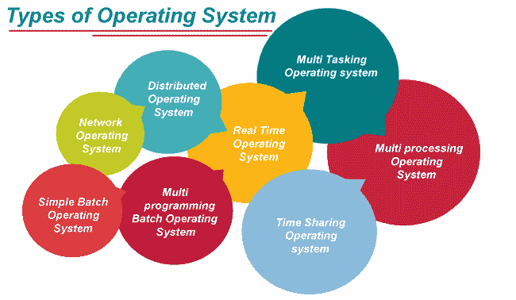
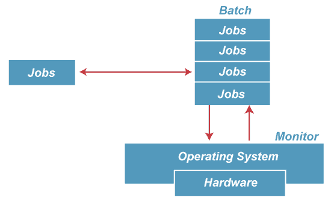
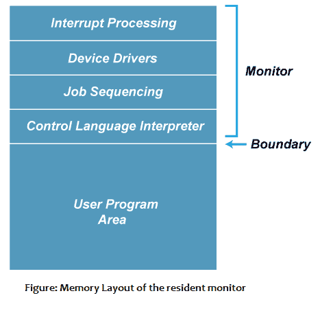
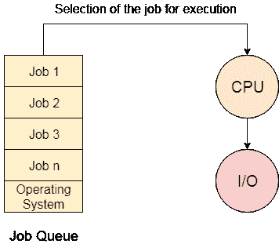
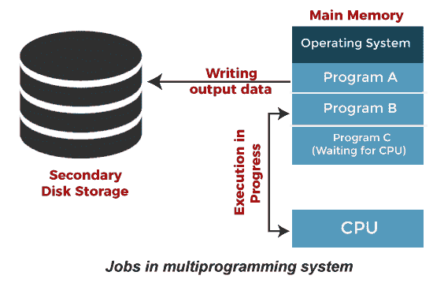
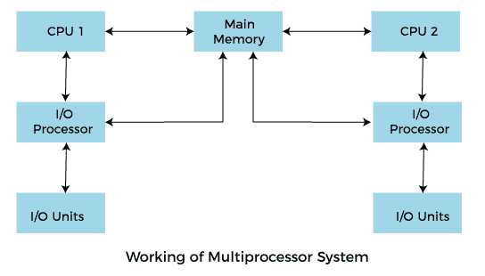
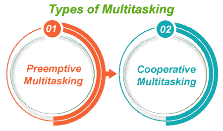
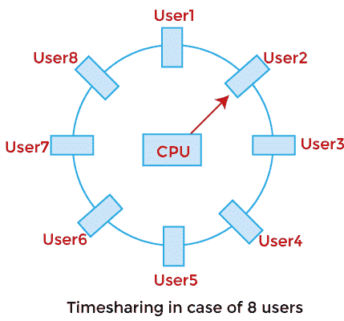
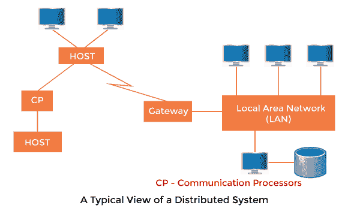

# 操作系统的类型

> 原文：<https://www.javatpoint.com/types-of-os>

操作系统是管理计算机硬件的组织良好的程序集合。它是一种系统软件，负责计算机系统的平稳运行。

## 批处理操作系统

在 20 世纪 70 年代，批处理非常流行。在这种技术中，相似类型的作业被一起批处理并及时执行。人们习惯于拥有一台叫做主机的电脑。

在批处理操作系统中，访问权限被授予多个用户；他们将各自的作业提交给系统执行。

系统根据先到先服务的原则将所有作业放在队列中，然后逐个执行作业。当所有作业执行完毕时，用户收集各自的输出。

该操作系统的目的主要是在作业完成后立即将控制权从一个作业转移到另一个作业。它包含一组称为常驻监视器的小程序，总是驻留在主存储器的一部分。其余部分用于维修作业。

### 批处理操作系统的优势

*   常驻监视器的使用提高了计算机效率，因为它消除了两个作业之间的 CPU 时间。

### 批处理操作系统的缺点

**1。饥饿**

批处理受到饥饿的困扰。

**例如:**

该批中有五个职务 J1，即 J2、jobs 乐队、J4 和 J5。如果 J1 的执行时间很长，那么其他四个作业将永远不会执行，否则它们将需要等待很长时间。因此，其他进程会挨饿。

**2。不互动**

批处理不适合依赖用户输入的作业。如果一个作业需要从控制台输入两个数字，那么它将永远不会在批处理场景中得到它，因为用户在执行时不在场。

## 多道程序操作系统

多道程序设计是批处理的扩展，在批处理中，中央处理器总是保持忙碌。每个进程需要两种类型的系统时间:CPU 时间和 IO 时间。

在多道程序设计环境中，当一个进程进行输入/输出时，中央处理器可以开始执行其他进程。因此，多道程序设计提高了系统的效率。

### 多道程序操作系统的优势

*   在整个系统中，它增加了，因为中央处理器总是有一个程序要执行。
*   响应时间也可以缩短。

### 多道程序操作系统的缺点

*   多道程序设计系统提供了一个环境，在这个环境中，各种系统资源被有效地使用，但是它们不提供任何用户与计算机系统的交互。

## 多处理操作系统

在多处理中，实现了并行计算。系统中有多个处理器，可以同时执行多个进程。这将增加系统的吞吐量。

在多处理中，实现了并行计算。系统中存在的多个处理器可以同时执行多个进程，这将增加系统的吞吐量。

多处理操作系统的优势:

*   **可靠性提高:**由于采用了多处理系统，处理任务可以分布在多个处理器中。这增加了可靠性，因为如果一个处理器出现故障，任务可以交给另一个处理器来完成。
*   **全程增加:**随着几个处理器的增加，可以在更少的时间内完成更多的工作。

多处理操作系统的缺点

*   多处理操作系统更加复杂，因为它同时处理多个处理器。

### 多任务操作系统

多任务操作系统是多道程序系统的逻辑扩展，可以同时支持多个程序。它允许用户同时执行多个计算机任务。

### 多任务操作系统的优势

*   这种操作系统更适合同时支持多个用户。
*   多任务操作系统有明确定义的内存管理。

### 多任务操作系统的缺点

*   在多任务环境中，多个处理器同时忙于完成任何任务，因此中央处理器产生更多热量。

## 网络操作系统

一个操作系统，包括软件和相关协议，通过网络与其他计算机进行方便和经济的通信，被称为网络操作系统。

### 网络操作系统的优势

*   在这种类型的操作系统中，由于客户端和服务器之间的划分，网络流量会减少。
*   这种系统的安装和维护成本较低。

### 网络操作系统的缺点

*   在这种类型的操作系统中，系统中任何节点的故障都会影响整个系统。
*   安全性和性能是重要的问题。因此，网络管理需要训练有素的网络管理员。

## 实时操作系统

在实时系统中，每项工作都有一个期限，在这个期限内，工作应该完成，否则，巨大的损失就会出现，或者即使产生了结果，也是完全没有用的。

实时系统的应用存在于军事应用的情况下，如果你想投掷导弹，那么导弹应该以一定的精度投掷。

### 实时操作系统的优势:

*   易于在实时操作系统下布局、开发和执行实时应用。
*   在实时操作系统中，设备和系统的最大利用率。

### 实时操作系统的缺点:

*   实时操作系统的开发成本非常高。
*   实时操作系统非常复杂，可能会消耗关键的 CPU 周期。

## 分时操作系统

在分时操作系统中，计算机资源以时间相关的方式同时分配给几个程序。因此，它有助于为大量用户提供对主计算机的直接访问。它是多道程序设计的逻辑扩展。在分时系统中，中央处理器在不同用户预定的多个程序之间切换。

分时操作系统允许同时服务多个用户，因此需要复杂的 CPU 调度方案和输入/输出管理。

分时操作系统的构建非常困难且昂贵。

### 分时操作系统的优势

*   分时操作系统提供了资源的有效利用和共享。
*   该系统减少了中央处理器空闲和响应时间。

### 分时操作系统的缺点

*   与其他方法相比，数据传输速率非常高。
*   当许多用户同时访问系统时，需要维护加载在内存和数据中的用户程序的安全性和完整性。

## 分布式操作系统

分布式操作系统不是安装在一台机器上，它被分成几个部分，这些部分被加载到不同的机器上。分布式操作系统的一部分安装在每台机器上，使它们的通信成为可能。分布式操作系统比网络操作系统复杂、庞大和复杂得多，因为它们还必须处理不同的网络协议。

### 分布式操作系统的优势

*   分布式操作系统提供资源共享。
*   这种类型的系统是容错的。

### 分布式操作系统的缺点

*   协议开销可以控制计算成本。

* * *