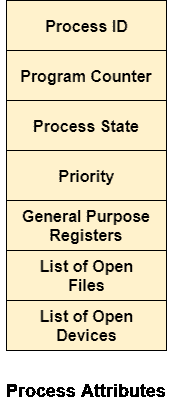

# 流程的属性

> 原文：<https://www.javatpoint.com/os-attributes-of-a-process>

操作系统使用过程的属性为每个过程创建过程控制块。这也称为过程的上下文。存储在印刷电路板中的属性描述如下。

### 1.流程标识

创建流程时，会为流程分配一个唯一的 id，用于系统中流程的唯一标识。

### 2.程序计数器

程序计数器存储进程暂停的最后一条指令的地址。当恢复执行该进程时，中央处理器使用该地址。

### 3.进程状态

这个过程，从创建到完成，经历了新的、准备好的、运行的和等待的各种状态。我们将在稍后详细讨论它们。

### 4.优先

每个流程都有自己的优先级。进程中优先级最高的进程首先获得 CPU。这也存储在过程控制块中。

### 5.通用寄存器

每个进程都有自己的一组寄存器，用于保存进程执行过程中生成的数据。

### 6.打开的文件列表

在执行过程中，每个进程都使用一些需要出现在主内存中的文件。操作系统还维护着印刷电路板中打开文件的列表。

### 7.打开的设备列表

操作系统还维护在进程执行期间使用的所有打开设备的列表。

