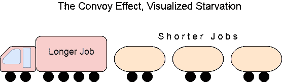
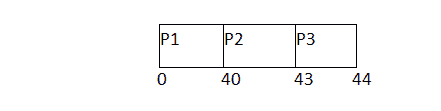
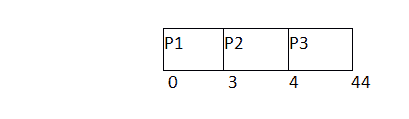

# FCFS 中的车队效应

> 原文：<https://www.javatpoint.com/os-convoy-effect-in-fcfs>

如果第一个作业的爆发时间是所有作业中最高的，FCFS 可能会受到**车队效应**的影响。在现实生活中，如果一个车队正在通过道路，那么其他人可能会被阻挡，直到它完全通过。这也可以在操作系统中模拟。

如果中央处理器在就绪队列的前端获得较高突发时间的进程，则较低突发时间的进程可能会被阻塞，这意味着如果执行中的作业具有非常高的突发时间，它们可能永远不会获得中央处理器。这被称为**车队效应**或**饥饿**。



### 例子

在本例中，我们有 3 个流程，分别名为 **P1、P2 和 P3** 。P1 的伯特时间是最高的。

下表中的周转时间和等待时间由以下公式计算:

```

	Turn Around Time = Completion Time - Arrival Time
		Waiting Time = Turn Around Time - Burst Time 

```

在第一个场景中，P1 进程到达队列中的第一个，虽然；该过程的爆发时间是所有过程中最高的。由于我们遵循的调度算法是 FCFS，因此中央处理器将首先执行进程 P1。

在这个时间表中，系统的平均等待时间将非常长。那是因为车队效应。其他进程 P2，P3 必须等待 40 个单位的时间，虽然他们的爆发时间很低。这个时间表受到饥饿的困扰。

| 流程标识 | 到达时间 | 突发时间 | 完成时间 | 解题时间 | 等待时间 |
| one | Zero | Forty | Forty | Forty | Zero |
| Two | one | three | Forty-three | forty-two | Thirty-nine |
| three | one | one | forty-four | Forty-three | forty-two |



平均等待时间= 81/3

在第二种情况下，如果 P1 进程早些时候到达队列的最后一个，而其他进程 P2 和 P3 早些时候到达，那么饥饿问题就不会出现。

以下示例显示了两种情况下等待时间的偏差。虽然时间表的长度是一样的，即 44 个单位，但等待时间将在这个时间表较少。

| 流程标识 | 到达时间 | 突发时间 | 完成时间 | 解题时间 | 等待时间 |
| one | one | Forty | forty-four | Forty-three | three |
| Two | Zero | three | three | three | Zero |
| three | Zero | one | four | four | three |



**平均等待时间=6/3**