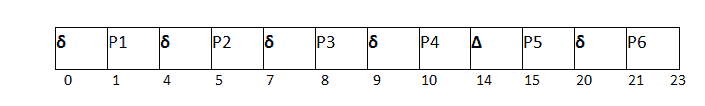

# 带开销的 FCFS

> 原文：<https://www.javatpoint.com/os-fcfs-with-overhead>

在上面的例子中，我们假设所有的进程都是 CPU 绑定的进程。我们也忽略了上下文切换时间。

然而，如果考虑调度器在上下文切换中花费的时间，那么系统的平均等待时间将增加，这也影响系统的效率。

上下文切换总是一个开销。下面的例子描述了如果在系统中考虑上下文切换时间将如何影响效率。

### 例子

在下面的例子中，我们正在考虑五个进程 P1、P2、P3、P4、五常和 P6。它们的到达时间和突发时间如下所示。

| 流程标识 | 到达时间 | 突发时间 |
| one | Zero | three |
| Two | one | Two |
| three | Two | one |
| four | three | four |
| five | four | five |
| six | five | Two |

如果系统的上下文切换时间是 1 个单位，那么系统的甘特图将如下准备。

给定 **δ=1 单位；**



在每个进程执行之后，系统将额外花费 1 个单位的时间(开销)来调度下一个进程。

```

Inefficiency= (6/23) X 100 % 

			Efficiencyͷ = (1-6/23) X 100 % 

```