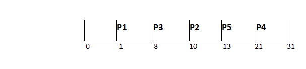

# 最短作业优先(SJF)计划

> 原文：<https://www.javatpoint.com/os-sjf-scheduling>

到目前为止，我们是根据进程的到达时间来调度它们的(在 FCFS 调度中)。然而，SJF 调度算法根据突发时间来调度进程。

在 SJF 调度中，就绪队列中可用进程列表中突发时间最短的进程将被调度。

然而，很难预测一个进程所需的突发时间，因此该算法很难在系统中实现。

## SJF 的优势

1.  最大排出量
2.  最小平均等待和周转时间

## SJF 的缺点

1.  可能会遭受饥饿的困扰
2.  这是不可实现的，因为无法提前知道进程的确切突发时间。

有不同的技术可以用来确定进程的中央处理器突发时间。我们将在稍后详细讨论它们。

### 例子

在下面的例子中，有五个职位被命名为 P1、P2、P3、P4 和五常。下表给出了它们的到达时间和突发时间。

| PID | 到达时间 | 突发时间 | 完成时间 | 解题时间 | 等待时间 |
| one | one | seven | eight | seven | Zero |
| Two | three | three | Thirteen | Ten | seven |
| three | six | Two | Ten | four | Two |
| four | seven | Ten | Thirty-one | Twenty-four | Fourteen |
| five | nine | eight | Twenty-one | Twelve | four |

因为，没有进程到达时间 0；在**甘特图**中，从时间 0 到 1(第一个流程到达的时间)会有一个空槽。

根据该算法，操作系统调度就绪队列中可用进程中突发时间最短的进程。

到目前为止，我们在就绪队列中只有一个进程，因此调度程序将把它调度给处理器，不管它的突发时间是多少。

这将执行到 8 个时间单位。在此之前，我们还有三个进程到达就绪队列，因此调度程序将选择突发时间最短的进程。

在表中给出的进程中，P3 将被执行，因为它在所有可用进程中具有最低的突发时间。

这就是**最短作业优先(SJF)** 调度算法的流程。

平均等待时间= 27/5