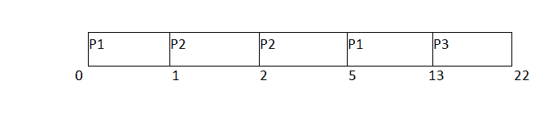

# SRTF 门 2011 示例

> 原文：<https://www.javatpoint.com/os-srtf-gate-2011-example>

如果我们从 GATE 的角度来谈调度算法，他们一般会问一些简单的数字问题，比如求平均等待时间和周转时间。让我们讨论一下 GATE 2011 中关于 SRTF 的问题。

### 问:给定下表中 3 个作业的到达时间和突发时间。计算系统的平均等待时间。

| 流程标识 | 到达时间 | 突发时间 | 完成时间 | 解题时间 | 等待时间 |
| one | Zero | nine | Thirteen | Thirteen | four |
| Two | one | four | five | four | Zero |
| three | Two | nine | Twenty-two | Twenty | Eleven |

有三个工作岗位 P1、P2 和 P3。P1 到达时间单位 0；在下一个进程到达之前，它将首先被调度。P2 在一个时间单位到达。其突发时间为 4 个单位，是队列中最少的作业。因此，它将被安排在下一个。

在时间 2，P3 将到达与爆发时间 9。因为 P2 的剩余爆发时间是 3 个单位，这是最少的可用工作。因此，处理器将继续执行直到完成。根据 SJF 的说法，因为所有的工作都已经到达，所以现在不会先发制人，所有的工作都将执行到完成。

平均等待时间= (4+0+11)/3 = 5 个单位