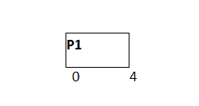
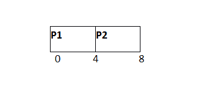
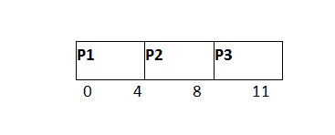
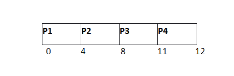
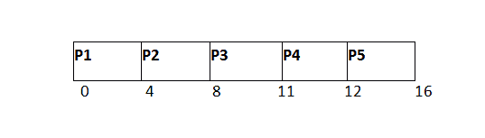
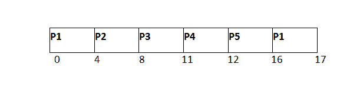
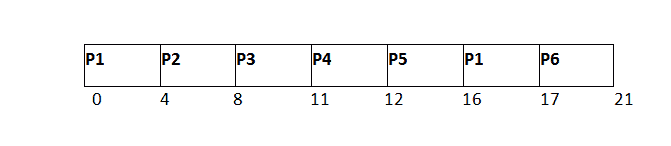
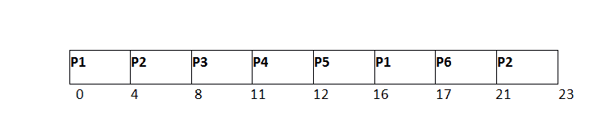
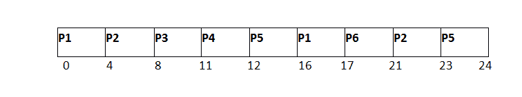

# RR 调度示例

> 原文：<https://www.javatpoint.com/os-round-robin-scheduling-example>

在下面的示例中，有六个进程被命名为 P1、P2、P3、P4、五常和 P6。它们的到达时间和爆发时间在下表中给出。系统的时间量子是 4 个单位。

| 流程标识 | 到达时间 | 突发时间 |
| one | Zero | five |
| Two | one | six |
| three | Two | three |
| four | three | one |
| five | four | five |
| six | six | four |

根据算法，我们必须维护就绪队列和甘特图。两种数据结构的结构在每次调度后都会改变。

### 就绪队列:

最初，在时间 0，进程 P1 到达，这将被调度为时间片 4 单位。因此，在就绪队列中，只有一个进程 P1 以 CPU 突发时间 5 个单位开始。

| 第一亲代 |
| five |

### 线条图

P1 将首先执行 4 个单位。



### 就绪队列

与此同时，P1、P2、P3、P4 和五常这四个国家的死刑正在等待执行。P1 还没有完成，它还需要 1 个单位的时间，因此它也将被添加回就绪队列。

| P2 | P3 | P4 | 孕烯醇酮 | 第一亲代 |
| six | three | one | five | one |

### 线条图

在 P1 之后，P2 将被执行 4 个时间单位，如甘特图所示。



### 就绪队列

在执行 P2 的过程中，又有一个进程 P6 到达了就绪队列。由于 P2 尚未完成，因此 P2 也将被添加回就绪队列，剩余突发时间为 2 个单位。

| P3 | P4 | 孕烯醇酮 | 第一亲代 | P6 | P2 |
| three | one | five | one | four | Two |

### 线条图

在 P1 和 P2 之后，P3 将被执行 3 个时间单位，因为它的中央处理器爆发时间只有 3 秒。



### 就绪队列

由于 P3 已经完成，因此它将被终止，不会被添加到就绪队列中。下一个要执行的程序是 P4。

| P4 | 孕烯醇酮 | 第一亲代 | P6 | P2 |
| one | five | one | four | Two |

### 线条图

之后，P1、P2 和 P3、P4 将被处死。它的爆发时间只有 1 个单位，比时间量少，因此它将被完成。



### 就绪队列

就绪队列中的下一个进程是 P5，具有 5 个单位的突发时间。由于 P4 已完成，因此不会将其添加回队列。

| 孕烯醇酮 | 第一亲代 | P6 | P2 |
| five | one | four | Two |

### 线条图

P5 将对整个时间片执行，因为它需要比时间片高 5 个单位的突发时间。



### 就绪队列

P5 尚未完成；它将被添加回队列，剩余突发时间为 1 个单位。

| 第一亲代 | P6 | P2 | 孕烯醇酮 |
| one | four | Two | one |

### 线条图

P1 将在下一轮完成这一进程。因为它只需要 1 个单位的突发时间，所以它将被完成。



### 就绪队列

P1 已完成，不会被添加回就绪队列。下一个过程 P6 只需要 4 个单位的突发时间，它将被执行。

| P6 | P2 | 孕烯醇酮 |
| four | Two | one |

### 线条图

P6 将被执行 4 个单位的时间，直到完成。



### 就绪队列

由于 P6 已完成，因此不会再将其添加到队列中。就绪队列中只有两个进程。下一个 P2 进程只需要 2 个时间单位。

| P2 | 孕烯醇酮 |
| Two | one |

### 线条图

P2 将再次被处决，因为它只需要 2 个单位的时间，因此这将被完成。



### 就绪队列

现在，队列中唯一可用的进程是 P5，它需要 1 个单位的突发时间。由于时间片为 4 个单位，因此它将在下一个突发中完成。

| 孕烯醇酮 |
| one |

### 线条图

P5 将被执行直到完成。



完工时间、周转时间和等待时间的计算如下表所示。

我们知道，

```

Turn Around Time = Completion Time - Arrival Time 
Waiting Time = Turn Around Time - Burst Time 

```

| 流程标识 | 到达时间 | 突发时间 | 完成时间 | 解题时间 | 等待时间 |
| one | Zero | five | Seventeen | Seventeen | Twelve |
| Two | one | six | Twenty-three | Twenty-two | Sixteen |
| three | Two | three | Eleven | nine | six |
| four | three | one | Twelve | nine | eight |
| five | four | five | Twenty-four | Twenty | Fifteen |
| six | six | four | Twenty-one | Fifteen | Eleven |

平均等待时间= (12+16+6+8+15+11)/6 = 76/6 台