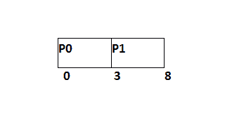
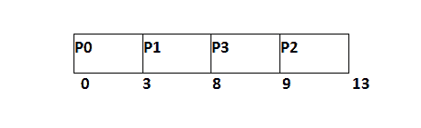
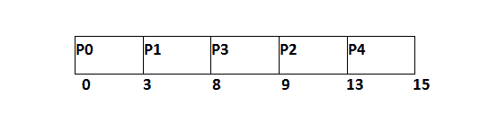

# HRNN 的例子

> 原文：<https://www.javatpoint.com/os-hrrn-example>

在下面的例子中，给出了 5 个过程。它们的到达时间和突发时间在表中给出。

| 流程标识 | 到达时间 | 突发时间 |
| Zero | Zero | three |
| one | Two | five |
| Two | four | four |
| three | six | one |
| four | eight | Two |

在时间 0，进程 P0 以 3 个单位的中央处理器突发时间到达。由于这是到目前为止唯一到达的过程，因此这将立即被安排。


P0 对 3 个单元执行，同时，只有一个进程 P1 在时间 3 到达。这将被立即安排，因为操作系统没有选择。



P1 被处决了 5 个单位。与此同时，所有流程都可用。我们必须计算所有剩余工作的响应率。

```

RR (P2) = ((8-4) +4)/4 = 2
RR (P3) = (2+1)/1 = 3
RR (P4) = (0+2)/2 = 1 

```

因为 P3 的回复率比较高，所以 P3 会排在第一位。


P3 预定 1 台。下一个可用的过程是 P2 和 P4。让我们计算一下他们的回应率。

```

RR ( P2) = (5+4)/4 = 2.25
RR (P4) = (1+2)/2 = 1.5 

```

P2 的回应率较高，因此 P2 将被安排。



现在，唯一可用的进程是突发时间为 2 个单位的 P4 进程，因为没有其他进程可用，因此将对此进行调度。



| 流程标识 | 到达时间 | 突发时间 | 完成时间 | 解题时间 | 等待时间 |
| Zero | Zero | three | three | three | Zero |
| one | Two | five | eight | six | one |
| Two | four | four | Thirteen | nine | five |
| three | six | one | nine | three | Two |
| four | eight | Two | Fifteen | seven | five |

平均等待时间= 13/5