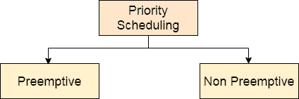
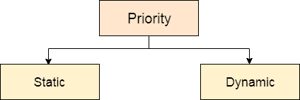

# 优先级调度

> 原文：<https://www.javatpoint.com/os-priority-scheduling>

在优先级调度中，每个进程都有一个优先级编号。在某些系统中，数字越低，优先级越高。而在其他情况下，数字越高，优先级越高。在可用进程中具有较高优先级的进程被赋予中央处理器。存在两种类型的优先级调度算法。一种是**优先**优先调度，另一种是**非优先**优先调度。

分配给每个进程的优先级可能不同，也可能不同。如果优先级号在整个过程中没有自我改变，则称为**静态优先级**，而如果它每隔一定时间保持自我改变，则称为**动态优先级**。

