# 带进程的 SRTF 包含中央处理器和输入输出时间

> 原文：<https://www.javatpoint.com/os-srtf-with-processes-contains-cpu-and-io-time>

到目前为止，我们只考虑受 CPU 限制的作业。然而，这个过程可能需要一些输入输出操作或一些资源来完成它的执行。在本例中，我们考虑的是输入输出绑定进程。

在该示例中，流程标识为 P1、P2、P3 和 P4 的四个作业可用。它们的到达时间和中央处理器突发时间在下表中给出。

| 流程标识 | 到达时间 | (突发时间、输入输出突发时间、突发时间) |
| one | Zero | (3,2,2) |
| Two | Zero | (1,3,1) |
| three | three | (3,1,2) |
| four | six | (5,4,5) |

### 甘特图准备

时间 0 时，P1 和 P2 进程到达。由于我们使用的算法是 SRTF 算法，因此突发时间最短的进程将在中央处理器上调度。在这种情况下，它就是 P2。

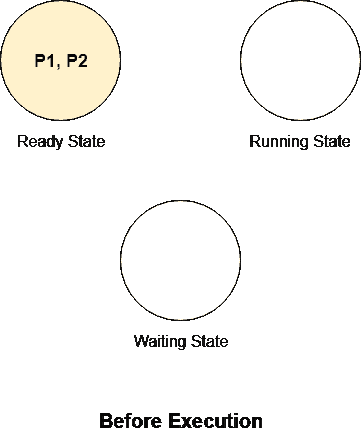
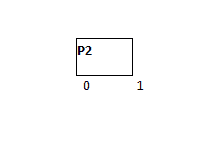

从时间 0 到时间 1，P2 将处于运行状态。

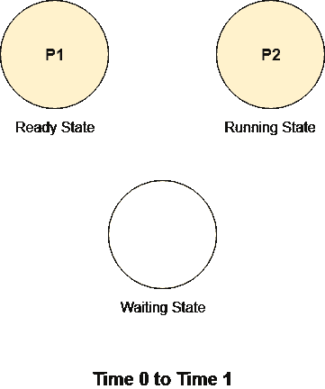

P2 也需要一些 IO 时间来完成它的执行。执行 1 个单位后，P2 将从运行状态变为等待状态。处理器可以自由执行其他作业。由于此时除了 P1 之外没有其他进程可用，因此 P1 将被处决。

下图说明了时间 1 的过程和状态。过程 P2 进入等待状态，此时 CPU 成为偶像。

从时间 1 到 3，由于 P2 处于等待状态，并且在就绪队列中没有其他进程可用，因此在这段时间内将执行唯一可用的进程 P1。

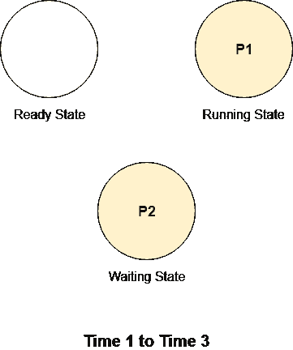
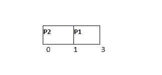

在时间 3，进程 P3 到达，总的中央处理器爆发时间为 5 个单位。由于 P1 剩余的突发时间比 P3 短，因此中央处理器将继续执行。

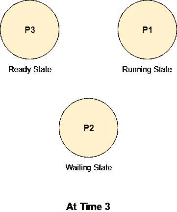

因此，从时间 3 到时间 4，P1 将保持运行状态。

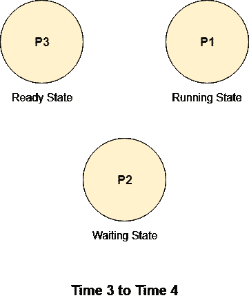
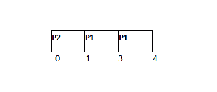

因为 P1 是一个输入输出绑定的过程。在时间单元 4，它将把它的状态从运行变为等待。处理器可以自由执行其他作业。因为 P2 也在时间 4 变得可用，因为它已经完成了输入输出操作，现在它需要另一个 1 单位的中央处理器突发时间。P3 也可用，需要 5 个单位的总 CPU 爆发时间。

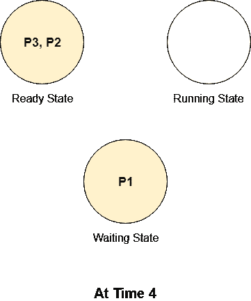

将执行可用进程中剩余 CPU 突发时间最少的进程。在我们的例子中，这样的过程是 P2，它需要 1 个单位的突发时间，因此它将被给予中央处理器。

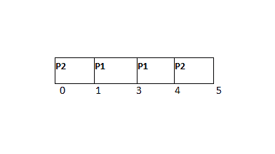

在时间 5，P2 完成了。P1 仍处于等待状态。此时，唯一可用的进程是 P3，因此它将被赋予中央处理器。

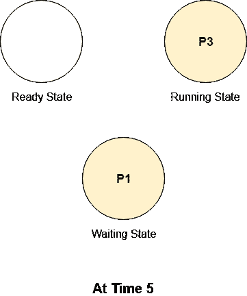

从时间 5 到时间 6，P3 将处于运行状态；与此同时，P1 仍将处于等待状态。

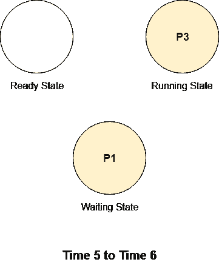
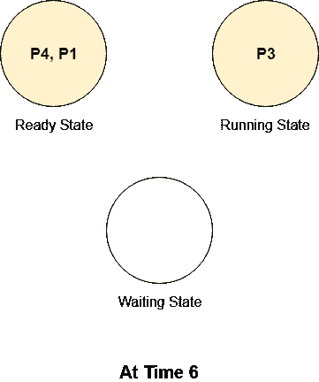
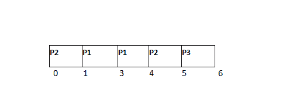

在时间 6，P4 进程到达就绪队列。P1 号也完成了输入输出，可以执行了。P3 还没有完成，还需要 2 个单位的 CPU 爆发时间。

从时间 6 到时间 8，进程 P3 的中央处理器突发时间是可用进程中最少的，因此 P3 将获得中央处理器。

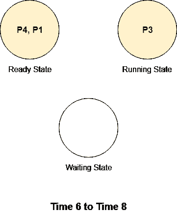
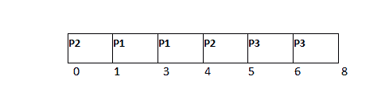

P3 需要一些输入输出操作来完成它的执行。在时间 8，P3 将改变其状态从运行到等待。中央处理器可以自由执行其他进程。进程 P4 和 P1 可用，其中剩余突发时间最少的进程将被执行。

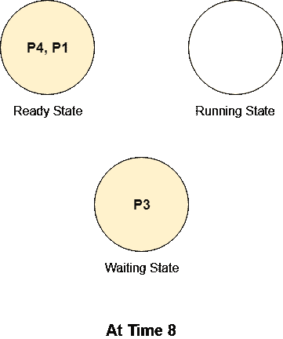

从时间 8 到时间 9，过程 P1 将被执行。

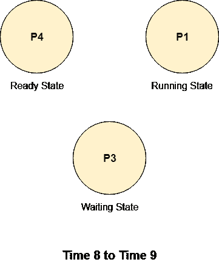
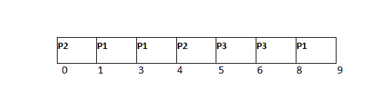

在时间 9，P3 进程的输入输出完成，现在它将与已经在那里等待轮到它的 P4 一起处于就绪状态。为了完成它的执行，它需要另外 2 个单位的突发时间。P1 此时处于运行状态，而等待状态下没有进程。

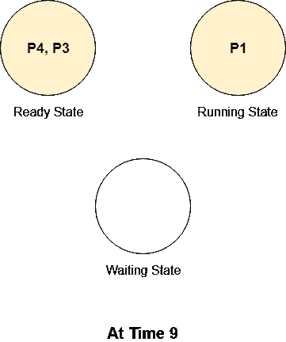
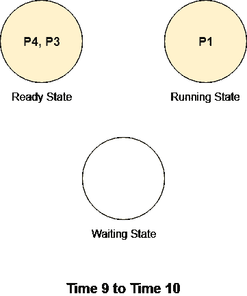

从时间 9 到 10，进程 P1 将被执行，因为它剩余的 CPU 突发时间比就绪队列中可用的进程 P4 和 P3 短。

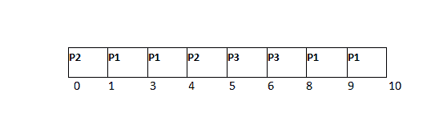
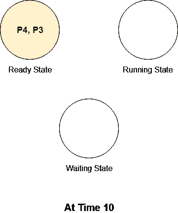

时间 10，P1 的死刑执行完毕，现在 CPU 变成了偶像。就绪进程中 CPU 突发时间较少的进程将获得 CPU 轮次。

从时间 10 到 12，进程 P3 将一直执行到完成，因为其剩余的 CPU 突发时间介于两个可用进程之间。它需要 2 个单位的 CPU 突发时间，因为没有其他进程将到达就绪状态，因此不会进行抢占，它将一直执行到完成。

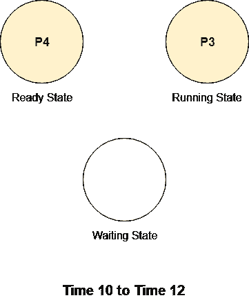
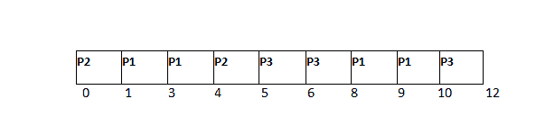

在时间 12，进程 P3 将完成，因为只有一个进程 P4 在就绪状态，因此 P4 将被给予中央处理器。

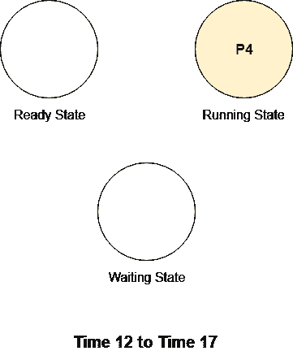

P4 在输入输出之前需要 5 个单位的中央处理器突发时间，因此它将执行到时间 17(对于 5 个单位)，然后它将将其状态从运行更改为等待。

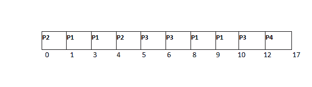

在时间 17，P4 进程将其状态从运行变为等待。由于这是系统中唯一的进程，因此中央处理器将一直是偶像，直到 P4 再次可用。

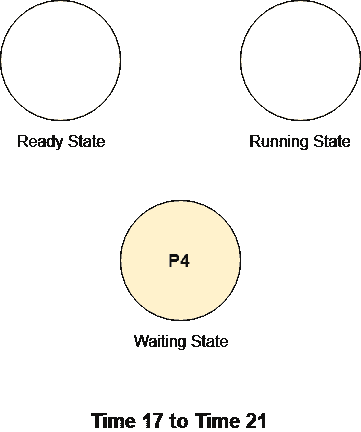
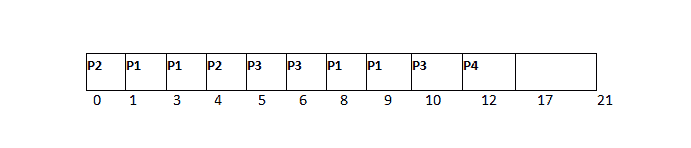

在时间 21，P4 将完成输入输出操作，并处于就绪状态。

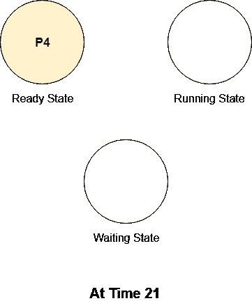

从时间 21 日起，P4 进程将如期进行。由于没有其他进程在就绪队列中，因此处理器没有任何选择。它将一直执行到完成。

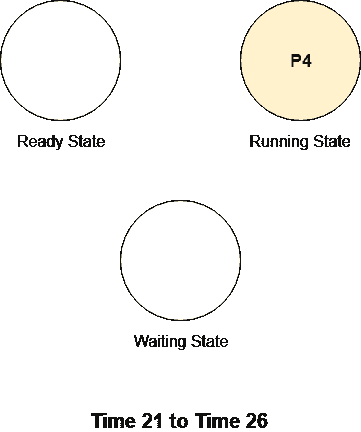

### 最终甘特图:

| 流程标识 | 到达时间 | 总中央处理器突发时间 | 完成时间 | 解题时间 | 等待时间 |
| one | Zero | five | Ten | Ten | five |
| Two | Zero | Two | five | five | three |
| three | three | five | Twelve | nine | four |
| four | six | Ten | Twenty-six | Twenty | Ten |

平均等待时间= (5+3+4+10)/4 = 22/4 个单位