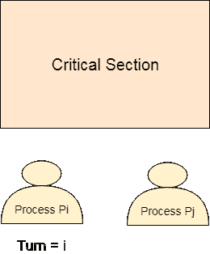
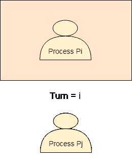
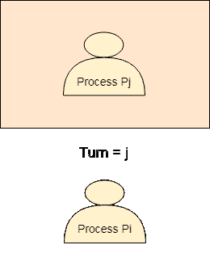

# 转向可变或严格的替代方法

> 原文：<https://www.javatpoint.com/os-turn-variable-or-strict-alternation-approach>

可变或严格交替方法是在用户模式下实现的软件机制。这是一个繁忙的等待解决方案，只能为两个进程实现。在这种方法中，使用了一个转弯变量，它实际上是一个锁。

这种方法只能用于两个过程。一般来说，让这两个过程是 Pi 和 Pj。它们共享一个变量，叫做转向变量。程序的伪代码可以给出如下。

**对于过程 Pi**

```

Non - CS 
while (turn ! = i); 
Critical Section 
turn = j; 
Non - CS

```

**对于工艺 Pj**

```

Non - CS 
while (turn ! = j);
Critical Section 
turn = i ;
Non - CS 

```

锁变量方法的实际问题是，只有当锁变量为 1 时，进程才进入临界区。多个进程可以同时看到锁变量为 1，因此不能保证互斥。

这个问题是在转弯变量法中解决的。现在，只有当转弯变量的值等于过程的 PID 时，过程才能进入临界区。

转弯变量只有两个可能的值，I 或 j，如果它的值不是 I，那么它肯定是 j，反之亦然。

在入口段，一般来说，过程 Pi 在其值为 j 之前不会进入临界段，或者过程 Pj 在其值为 I 之前不会进入临界段。

最初，有两个进程 Pi 和 Pj 可用，并希望执行到关键部分。



转向变量等于 I，因此 Pi 将有机会进入临界区。π的值保持为 1，直到π完成临界截面。



Pi 完成它的关键部分，并指定 j 为转向变量。Pj 将有机会进入关键区域。在 Pj 完成其关键部分之前，转弯值保持为 j。



## 严格替代方法分析

让我们根据四个要求来分析严格交替法。

### 互斥现象

严格的交替方法在每种情况下都提供互斥。此过程仅适用于两个过程。两个进程的伪代码都不同。流程只有在看到转弯变量等于其流程标识时才会进入，否则不会进入。因此，任何流程都不能进入关键部分，无论其转弯如何。

### 进步

这一机制不能保证取得进展。如果π不想在轮到它的时候进入关键区域，那么 Pj 会被无限时间的阻挡。Pj 必须等待很长时间才能轮到它，因为转弯变量将保持为 0，直到 Pi 将其分配给 j。

### 轻便

该解决方案提供了便携性。它是在用户模式下实现的纯软件机制，不需要来自操作系统的任何特殊指令。

