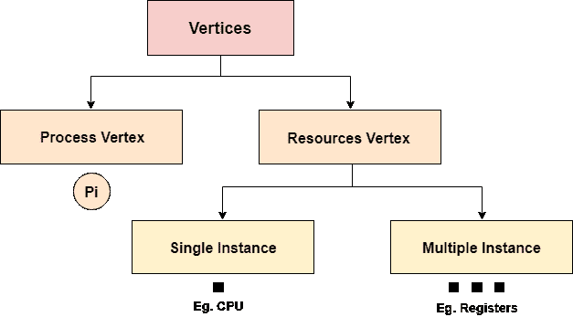
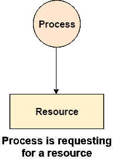
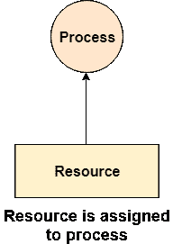
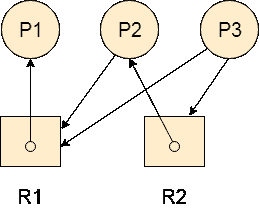

# 资源分配图

> 原文：<https://www.javatpoint.com/os-resource-allocation-graph>

资源分配图是系统状态的图形表示。顾名思义，资源分配图是关于持有某些资源或等待某些资源的所有进程的完整信息。

它还包含关于所有资源的所有实例的信息，无论它们是可用的还是正在被进程使用。

在资源分配图中，流程用圆形表示，而资源用矩形表示。让我们详细看看顶点和边的类型。

顶点主要有两种类型，资源和进程。它们中的每一个都将由不同的形状来表示。圆形代表进程，矩形代表资源。

一个资源可以有多个实例。每个实例将由矩形内的一个点表示。

RAG 中的边也有两种类型，一种代表工作分配，另一种代表进程对资源的等待。上图显示了他们每个人。

如果箭头的尾部连接到资源的实例，而头部连接到进程，则资源显示为已分配给进程。

如果箭头的尾部附在进程上，而头部指向资源，则进程显示为在等待资源。

 

### 例子

让我们考虑 3 个进程 P1，P2 和 P3，以及两种类型的资源 R1 和 R2。资源各有一个实例。

根据图表，P1 正在使用 R1，P2 正在等待 R2 和 R1，P3 正在等待 R1 以及 R2。

该图没有死锁，因为图中没有形成循环。

