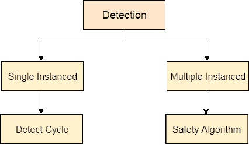
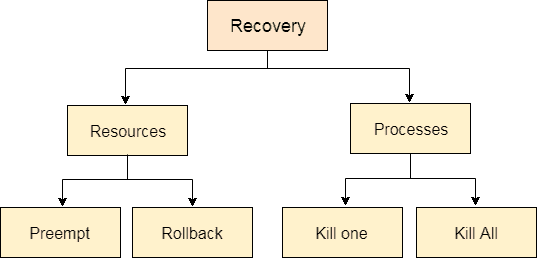

# 死锁检测和恢复

> 原文：<https://www.javatpoint.com/os-deadlock-detection-and-recovery>

在这种方法中，操作系统不应用任何机制来避免或防止死锁。因此，系统认为死锁肯定会发生。为了摆脱死锁，操作系统定期检查系统是否有死锁。万一发现任何死锁，操作系统将使用一些恢复技术恢复系统。

操作系统的主要任务是检测死锁。操作系统可以借助资源分配图来检测死锁。

在单实例资源类型中，如果系统中正在形成循环，那么肯定会出现死锁。另一方面，在多实例资源类型图中，检测一个周期是不够的。我们必须通过将资源分配图转换为分配矩阵和请求矩阵来将安全算法应用于系统。

为了从死锁中恢复系统，操作系统会考虑资源或进程。

## 对于资源

### 抢占资源

我们可以从资源(进程)的所有者那里抢走其中一个资源，并把它交给另一个进程，期望它能完成执行并更快地释放这个资源。嗯，选择一个会被抢走的资源会有点困难。

### 回滚到安全状态

系统通过各种状态进入死锁状态。操作系统可以将系统回滚到以前的安全状态。为此，操作系统需要在每个状态下实现检查点。

当我们陷入死锁的时候，我们将回滚所有的分配以进入之前的安全状态。

## 对于流程

### 终止进程

杀死一个进程可以解决我们的问题，但更大的问题是决定杀死哪个进程。一般来说，操作系统会杀死一个到目前为止工作量最少的进程。

### 杀死所有进程

这不是一个受暗示的方法，但如果问题变得非常严重，可以实施。杀死所有进程将导致系统效率低下，因为所有进程将从启动时再次执行。

