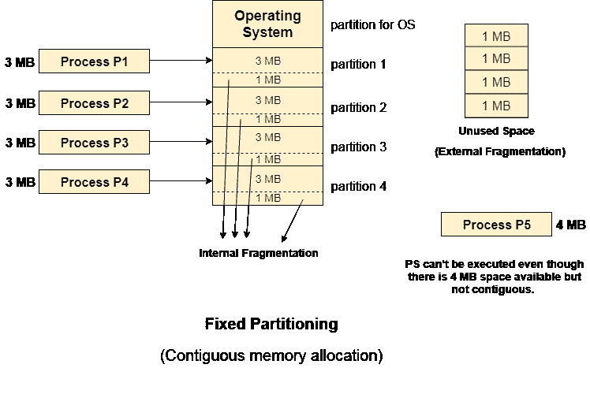

# 固定分区

> 原文：<https://www.javatpoint.com/os-fixed-partitioning>

最早也是最简单的技术之一是固定分区或连续内存分配，可用于将多个进程加载到主内存中。

在这种技术中，主存被分成大小相等或不同的分区。操作系统总是驻留在第一个分区中，而其他分区可以用来存储用户进程。内存以连续的方式分配给进程。

在固定分区中，

1.  分区不能重叠。
2.  进程必须连续存在于分区中才能执行。

使用这种技术有各种各样的缺点。

**1。内部碎片**

如果进程的大小小于分区的总大小，那么部分分区会被浪费并保持未使用。这是内存的浪费，称为内部碎片。

如下图所示，4 MB 分区仅用于加载 3 MB 进程，剩余的 1 MB 被浪费了。

**2。外部碎片**

各种分区的总未用空间不能用于加载进程，即使有可用空间但不是连续形式。

如下图所示，每个分区剩余的 1 MB 空间不能用作存储 4 MB 进程的单元。尽管有足够的空间来加载进程，但进程不会被加载。

**3。工艺尺寸的限制**

如果进程大小大于最大分区大小，则该进程无法加载到内存中。因此，可以对进程大小施加限制，即它不能大于最大分区的大小。

**4。多道程序的程度更少**

通过多程序设计的程度，我们简单地表示可以同时加载到内存中的进程的最大数量。在固定分区中，多道程序设计的程度是固定的，并且非常小，因为分区的大小不能根据进程的大小而变化。

