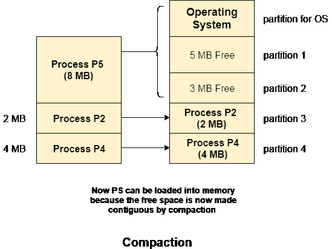

# 压紧

> 原文：<https://www.javatpoint.com/os-compaction>

我们知道动态分区受到外部碎片的影响。然而，这可能会导致一些严重的问题。

为了避免压缩，我们需要改变规则，即进程不能存储在内存的不同位置。

我们还可以使用压缩来最小化外部碎片的概率。在压缩中，所有空闲分区都是连续的，所有加载的分区都放在一起。

通过应用这种技术，我们可以在内存中存储更大的进程。自由分区被合并，现在可以根据新进程的需要进行分配。这种技术也被称为碎片整理。



如上图所示，由于缺少连续空间而无法加载到内存中的进程 P5 现在可以加载到内存中，因为空闲分区是连续的。

### 压实的问题

在压缩的情况下，系统的效率降低，因为所有的空闲空间将从几个地方转移到一个地方。

这个过程投入了大量的时间，并且 CPU 将一直处于空闲状态。尽管压缩避免了外部碎片，但它使系统效率低下。

让我们考虑一下，操作系统需要 6 NS 才能将 1 个字节从一个地方复制到另一个地方。

```

1 B transfer needs 6 NS 
256 MB transfer needs 256 X 2^20 X 6 X 10 ^ -9 secs

```

因此，在某种程度上证明了较大尺寸的存储器传输需要一些以秒为单位的大量时间。