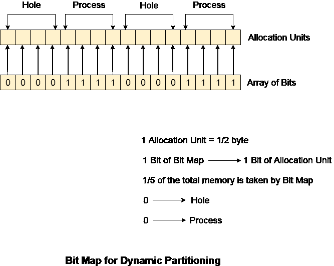

# 动态分区的位图

> 原文：<https://www.javatpoint.com/os-bit-map-for-dynamic-partitioning>

动态分区的主要关注点是跟踪所有空闲和分配的分区。但是，操作系统在此任务中使用以下数据结构。

1.  位图
2.  合框架

位图是最不出名的存储细节的数据结构。在这个方案中，主存被分成分配单元的集合。根据进程的需要，可以将一个或多个分配单元分配给该进程。但是，分配单元的大小是固定的，由操作系统定义，从不更改。虽然分区大小可能不同，但分配大小是固定的。

操作系统的主要任务是跟踪分区是空闲还是已满。为此，操作系统还管理另一种称为位图的数据结构。

分配单元中的进程或孔由位图的标志位表示。在下图中，为分配单元的每一位定义了一个标志位。然而，这不是一般情况，它取决于操作系统，对于分配单元的多少位，它想要存储标志位。

如果在分配单元中的相邻位存在连续存在的处理，标志位被设置为 1，否则它被设置为 0。

位图中的 0 字符串表示相对分配单元中有一个孔，而 1 字符串表示相对分配单元中的进程。



## 使用位图的缺点

1.操作系统还必须为位图分配一些内存，因为它存储了有关分配单元的详细信息。那么多的内存不能用于加载任何进程，因此降低了多道程序设计的程度和吞吐量。

在上图中，

分配单位为 4 位，即 0.5 位。这里，位图的 1 位代表分配单元的 1 位。

```

Size of 1 allocation unit = 4 bits 
Size of bitmap = 1/(4+1) = 1/5 of total main memory. 

```

因此，在这种位图配置中，浪费了总主内存的 1/5。

2.为了识别内存中的任何漏洞，操作系统需要在位图中搜索 0 字符串。这种搜索需要大量的时间，这使得系统在某种程度上效率低下