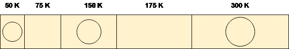
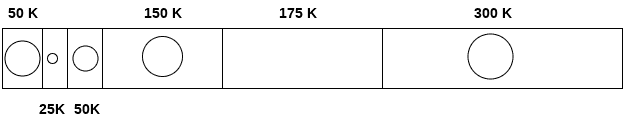
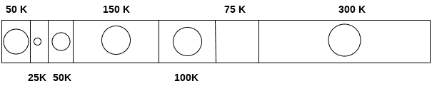
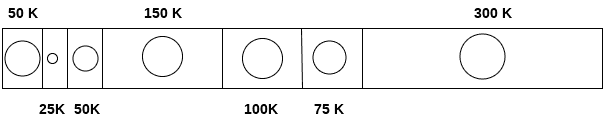
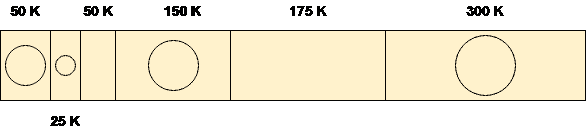
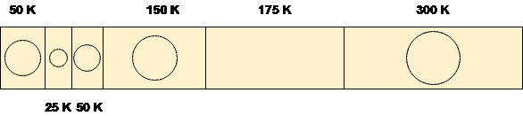
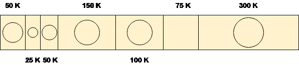
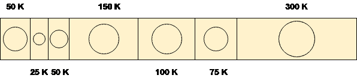

# 关于最佳拟合和首次拟合的 GATE 问题

> 原文：<https://www.javatpoint.com/os-gate-question-on-best-fit-and-first-fit>

从 GATE 的角度来看，最佳拟合和第一次拟合的数值在 1 分钟内被频繁询问。让我们看看下面给出的那个。

### 问:流程请求如下:

**25 K、50 K、100 K、75 K**

确定最能满足这一要求的算法。

1.  首次拟合算法
2.  最佳拟合算法
3.  两者都不是
4.  他们都

在问题中，内存中有五个分区。3 个分区内部有进程，两个分区是孔。

我们的任务是检验算法是否最能满足要求。

## 使用首次拟合算法

让我们看看，first fit 算法是如何处理这个问题的。

### 1.25 K 要求

该算法扫描列表，直到它得到第一个孔，该孔应该足够大以满足 25 K 的请求。它得到第二个分区中空闲的空间，因此它将 75 K 中的 25 K 分配给进程，剩余的 50 K 作为孔产生。

### 2.50 K 要求

50 K 的要求可以通过向进程分配大小为 50 K 的第三个分区来满足。没有自由空间是作为自由空间产生的。

### 3.100 千要求

使用 175 K 大小的第五个分区可以满足 100 K 的要求。在 175 K 中，将分配 100 K，剩余的 75 K 将作为一个洞存在。

### 4.75 K 要求

由于我们有一个 75 K 的空闲分区，因此我们可以将这么多空间分配给只需要 75 K 空间的进程。

使用第一次拟合算法，我们已经最佳地完成了整个请求，没有剩余无用的空间。

让我们看看，最佳拟合算法如何解决这个问题。

## 使用最佳拟合算法

### 1.25 K 要求

要使用最佳匹配方法分配 25 K 空间，需要扫描整个列表，然后我们发现一个 75 K 的分区是空闲的，并且是所有分区中最小的，可以满足进程的需要。

因此，这些 75 K 空闲分区中的 25 K 被分配给该进程，剩余的 50k 作为一个孔产生。

### 2.50 K 要求

为了满足这一需求，我们将再次扫描整个列表，然后找到与需求完全匹配的 50 K 空闲空间。因此，它将被分配给进程。

### 3.100 千要求

100 K 的需求足够接近 175 K 的空间。该算法扫描整个列表，然后从第 5 个空闲分区的 175 K 中分配 100 K。

### 4.75 K 要求

75 K 需求将从第 6 个自由分区获得 75 K 的空间，但是算法将在做出这个决定的过程中扫描整个列表。

通过跟踪这两种算法，我们注意到这两种算法的性能与这种情况下的大多数现存算法相似。

两者都可以满足流程的需要，但是最佳匹配算法会一遍又一遍地扫描列表，这需要花费大量时间。

因此，如果你问我哪个算法的性能更优，那么肯定是**优先拟合算法**。

所以，这个案例的答案是 a。