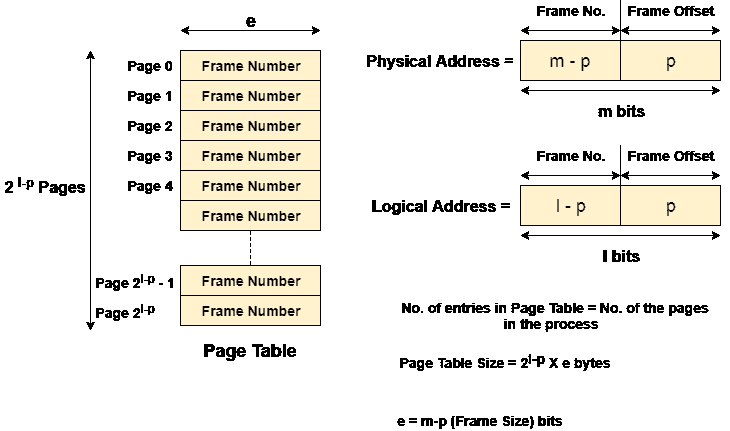
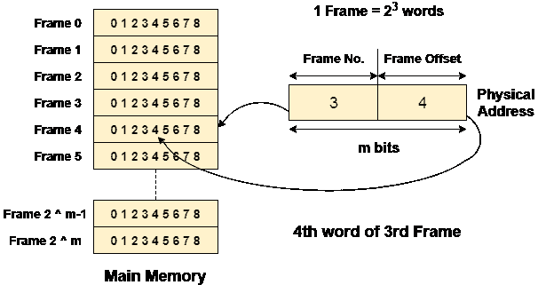

# 页表

> 原文：<https://www.javatpoint.com/os-page-table>

页表是虚拟内存系统用来存储逻辑地址和物理地址之间映射的数据结构。

逻辑地址由中央处理器为进程的页面生成，因此通常由进程使用。

物理地址是内存的实际帧地址。它们通常由硬件使用，或者更具体地由随机存取存储器子系统使用。

下面给出的图像考虑了，

Physical Address Space = M words
Logical Address Space = L words
Page Size = P words

Physical Address = log 2 M = m bits
Logical Address = log 2 L = l bits
page offset = log 2 P = p bits

中央处理器总是通过进程的逻辑地址来访问它们。然而，主存储器只识别物理地址。

在这种情况下，一个名为内存管理单元的单元就出现了。它将逻辑地址的页码转换为物理地址的帧号。两个地址的偏移量保持不变。

为了执行这个任务，内存管理单元需要一种特殊的映射，这种映射是通过页表来完成的。页表存储对应于页表页码的所有框架编号。

换句话说，页表将页码映射到它在内存中的实际位置(帧号)。

在下面给出的图像中，显示了如何借助偏移量访问帧的所需字。

