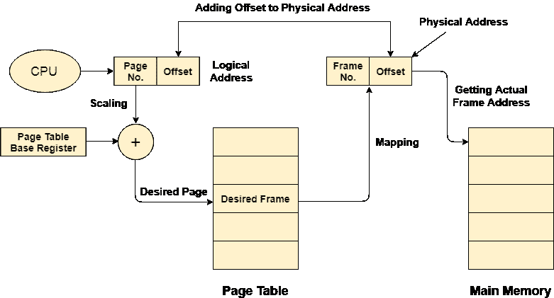

# 从页表到主存储器的映射

> 原文：<https://www.javatpoint.com/os-mapping-from-page-table-to-main-memory>

在操作系统中，总是需要从逻辑地址映射到物理地址。然而，该过程涉及如下定义的各种步骤。

## 1.逻辑地址的生成

中央处理器为进程的每一页生成逻辑地址。这包含两个部分:页码和偏移量。

## 2.缩放比例

为了确定进程的实际页码，中央处理器将页表库存储在一个特殊的寄存器中。每次生成地址时，都将页表基的值添加到页码中，以获得页条目在表中的实际位置。这个过程叫做缩放。

## 3.物理地址的生成

所需页面的框架号由其在页面表中的条目决定。生成的物理地址也包含两部分:帧号和偏移量。偏移将类似于逻辑地址的偏移，因此它将从逻辑地址复制。

## 4.获取实际帧数

帧号和相对于物理地址的偏移量被映射到主存储器，以便获得实际的字地址。

