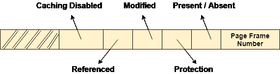

# 页表条目

> 原文：<https://www.javatpoint.com/os-page-table-entry>

除了页面帧号，页面表还包含一些表示页面额外信息的位。

让我们看看每一位代表了页面的什么。

## 1.缓存已禁用

有时候，离 CPU 最近的信息和离用户最近的信息是有区别的。操作系统总是希望 CPU 尽快访问用户的数据。在某些情况下，中央处理器访问缓存可能不准确，因此，操作系统可以禁用所需页面的缓存。如果缓存被禁用，该位置 1。

## 2.引用的

有各种页面替换算法，这将在本教程的后面介绍。如果页面在最后一个时钟周期内被引用，该位置 1，否则该位置 0。

## 3.修改

如果页面已被修改，该位将被置 1，否则保持 0。

## 4.保护

保护字段表示页面上应用的保护级别。它可以是只读的，也可以是读写或执行的。我们需要记住，它不是一位，而是一个包含许多位的字段。

## 5.出席/缺席

在请求分页的概念中，所有的页面不需要存在于主存储器中。因此，对于存在于主存储器中的所有页面，该位将被设置为 1，对于不存在的所有页面，该位将为 0。

如果某个页面不在主内存中，则称之为页面错误。

