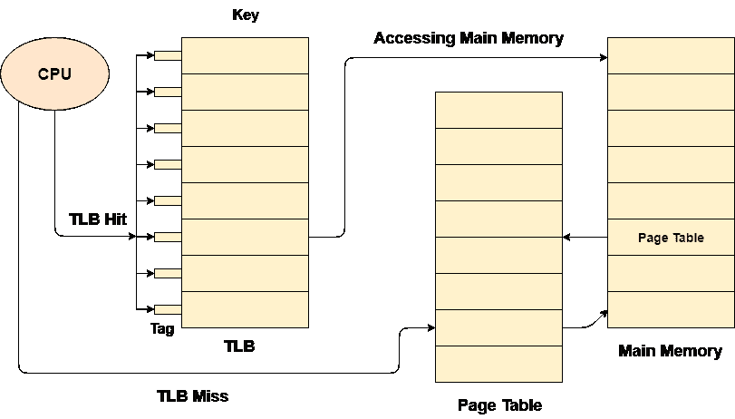

# 翻译后备缓冲器

> 原文：<https://www.javatpoint.com/os-translation-look-aside-buffer>

## 分页的缺点

1.  页表的大小可能非常大，因此会浪费主内存。
2.  CPU 从主存读取一个字需要更多的时间。

## 如何减小页表大小

1.  页表的大小可以通过增加页的大小来减小，但是这会导致内部碎片，并且还会有页的浪费。
2.  另一种方法是使用多级寻呼，但这增加了有效访问时间，因此这不是一种实用的方法。

## 如何减少有效访问时间

1.  中央处理器可以使用存储有页表的寄存器，这样访问页表的访问时间可以变得非常少，但是寄存器并不便宜，并且与页表大小相比它们非常小。因此，这也不是一种实用的方法。
2.  为了克服分页中的这些缺点，我们必须寻找一种比寄存器更便宜、比主存储器更快的存储器，这样就可以减少中央处理器一次又一次访问页表所花费的时间，并且它只能专注于访问实际的字。

## 参考地点

在操作系统中，引用局部性的概念表明，操作系统可以只加载主内存中那些被中央处理器频繁访问的页面，而不是将整个进程加载到主内存中，同时，操作系统还可以只加载那些与这些页面相对应的页面表项。

## 翻译后备缓冲器(TLB)

翻译后备缓冲器可被定义为存储器高速缓存，其可用于减少反复访问页表所花费的时间。

它是一个更靠近中央处理器的内存缓存，中央处理器访问 TLB 所需的时间比访问主内存所需的时间少。

换句话说，我们可以说 TLB 比主存更快更小，但比寄存器更便宜更大。

TLB 遵循引用位置的概念，这意味着它只包含 CPU 频繁访问的那些页面的条目。



在翻译后备缓冲器中，有标签和关键字，在它们的帮助下，映射被完成。

TLB 命中是在翻译后备缓冲器中找到所需条目的条件。如果发生这种情况，那么中央处理器只需访问主存储器中的实际位置。

然而，如果在 TLB 没有找到条目(TLB 未命中)，那么 CPU 必须访问主存储器中的页表，然后访问主存储器中的实际帧。

因此，在 TLB 命中的情况下，与 TLB 未命中的情况相比，有效访问时间将更短。

如果 TLB 命中的概率是 P% (TLB 命中率)，那么 TLB 失误的概率(TLB 失误率)将是(1-P) %。

因此，有效访问时间可以定义为:

```

EAT = P (t + m) + (1 - p) (t + k.m + m)

```

其中，p → TLB 命中率，t →访问 TLB 所花费的时间，m →访问主存储器 k = 1 所花费的时间，如果已经实现了单级分页的话。

通过公式，我们知道

1.  如果 TLB 命中率增加，有效访问时间将减少。
2.  在多级寻呼的情况下，有效接入时间将增加。