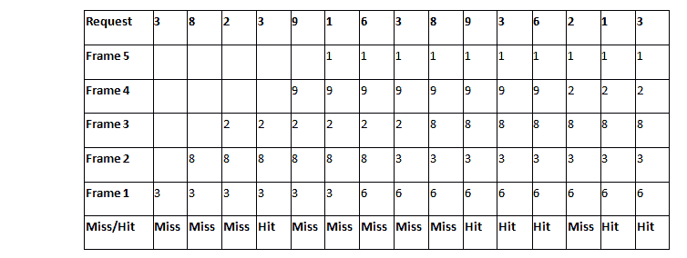
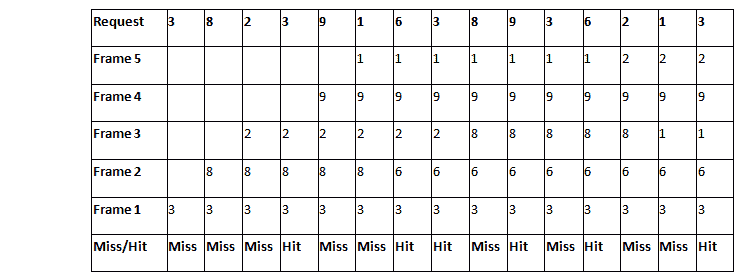

# 2015 年关于 LRU 和国际足联的问题

> 原文：<https://www.javatpoint.com/os-gate-2015-question-on-lru-and-fifo>

### 问:考虑一个有五个页面框架和以下页面引用序列的主内存:3，8，2，3，9，1，6，3，8，9，3，6，2，1，3。关于页面替换策略先进先出(FIFO)和最近最少使用(LRU)，以下哪一项是正确的？

**A** 。两者都有相同数量的页面错误
**B** 。先进先出产生的页面错误比 LRU
T6】C 多 2 个。LRU 比先进先出
T9]D 多 2 个页面错误。先进先出比 LRU 多 1 页错误

**解决方案:**

帧数= 5

## 先进先出。比较 LIFO

根据先进先出，首先进入内存的页面会先出去。

页面错误数= 9
点击数= 6

## 最近最少使用算法

根据 LRU 的说法，长时间没有被请求的页面将被新页面替换。

页面错误数= 9
点击数= 6

两种情况下的页面错误数量相等，因此答案为**选项(A)** 。