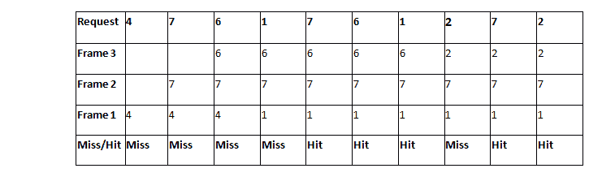
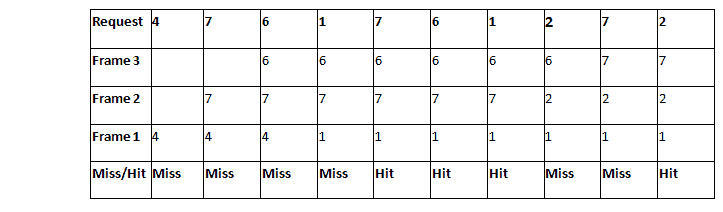
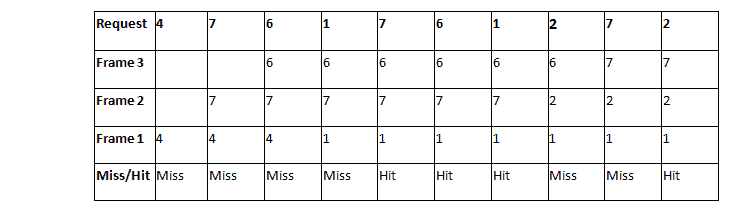

# 最优、LRU 和先进先出的数值研究

> 原文：<https://www.javatpoint.com/os-numerical-on-lru-fifo-and-optimal>

### 问:考虑一个引用字符串:4，7，6，1，7，6，1，2，7，2。内存中的帧数是 3。找出以下页面错误的数量:

1.  最优页面替换算法
2.  先进先出页面替换算法
3.  LRU 页面替换算法

## 最优页面替换算法

**最佳页面替换算法中的页面错误数= 5**

## LRU 页面替换算法

**LRU 页面错误数= 6**

## 先进先出页面替换算法

**先进先出中的页面错误数= 6**