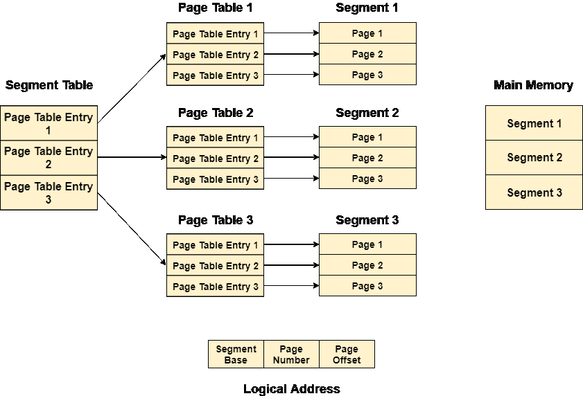
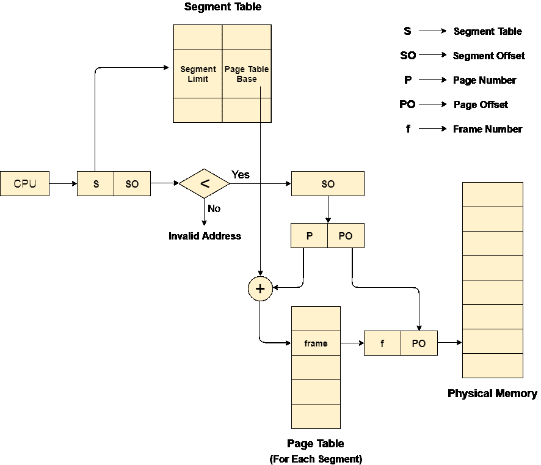

# 分段分页

> 原文：<https://www.javatpoint.com/os-segmented-paging>

纯分段不是很流行，也没有在许多操作系统中使用。然而，分割可以与分页相结合，从这两种技术中获得最佳特性。

在分段分页中，主存被分成可变大小的段，这些段又被分成固定大小的页。

1.  页面比段小。
2.  每个段都有一个页表，这意味着每个程序都有多个页表。
3.  逻辑地址表示为段号(基址)、页码和页面偏移量。

**段号→** 它指向合适的段号。

**页码→** 它指向段内的精确页面

**页面偏移→** 用作页面框架内的偏移

每个页面表都包含关于该段的每一页的各种信息。段表包含每个段的信息。每个段表条目指向一个页表条目，并且每个页表条目被映射到段内的一个页。

## 逻辑地址到物理地址的转换

中央处理器生成一个逻辑地址，该地址分为两部分:段号和段偏移量。段偏移必须小于段限制。偏移量又分为页码和页面偏移量。为了在页表中映射精确的页码，页码被添加到页表库中。

具有页面偏移的实际帧号被映射到主存储器，以在进程的特定段的页面中获得期望的字。

## 分段分页的优点

1.  它减少了内存使用。
2.  页表大小受到段大小的限制。
3.  段表只有一个对应于一个实际段的条目。
4.  外部碎片不存在。
5.  它简化了内存分配。

## 分段分页的缺点

1.  内部碎片会在那里。
2.  与分页相比，复杂度要高得多。
3.  页表需要连续存储在内存中。