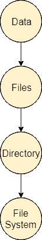

# 什么是文件？

> 原文：<https://www.javatpoint.com/os-attributes-of-the-file>

文件可以定义为存储记录序列的数据结构。文件存储在文件系统中，文件系统可能存在于磁盘或主内存中。文件可以是简单的(纯文本)或复杂的(特殊格式)。

文件的集合称为目录。不同级别的目录集合称为文件系统。

## 文件的属性

**1。名称**

每个文件都带有一个名称，通过该名称文件系统可以识别该文件。一个目录不能有两个同名文件。

**2 .标识符〔t1〕**

除了名称，每个文件都有自己的扩展名，用于标识文件的类型。例如，一个文本文件的扩展名为**。txt、**一个视频文件可以有扩展名 **.mp4\.**

**3。类型**

在文件系统中，文件分为不同的类型，如视频文件、音频文件、文本文件、可执行文件等。

**4。位置**

在文件系统中，有几个位置可以存储文件。每个文件都以其位置作为属性。

**5。尺寸**

文件的大小是它最重要的属性之一。我们所说的文件大小是指文件在内存中获取的字节数。

**6。保护**

计算机管理员可能希望对不同的文件提供不同的保护。因此，对于不同的用户组，每个文件都有自己的一组权限。

**7。时间和日期**

每个文件都带有一个时间戳，其中包含文件上次修改的时间和日期。