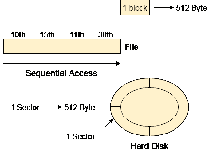
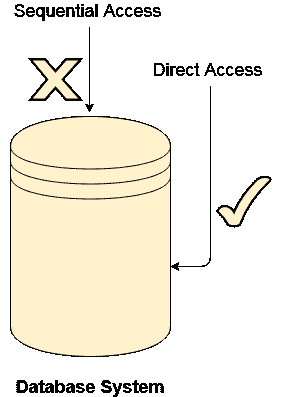

# 文件访问方法

> 原文：<https://www.javatpoint.com/os-file-access-methods>

让我们看看访问存储在辅助内存中的文件的各种方法。

## 顺序存取

大多数操作系统按顺序访问文件。换句话说，我们可以说大部分文件需要被操作系统顺序访问。

在顺序访问中，操作系统逐字读取文件。维护一个指针，该指针最初指向文件的基址。如果用户想要读取文件的第一个字，指针会将该字提供给用户，并将其值增加 1 个字。这个过程一直持续到文件结束。

现代文字系统确实提供了直接访问和索引访问的概念，但最常用的方法是顺序访问，因为大多数文件，如文本文件、音频文件、视频文件等都需要顺序访问。

## 直接存取

在数据库系统的情况下，直接访问是最需要的。在大多数情况下，我们需要从数据库中过滤信息。在这种情况下，顺序访问可能非常慢且效率低下。

假设存储的每个块存储 4 条记录，并且我们知道我们需要的记录存储在第 10 个块中。在这种情况下，将不会实现顺序访问，因为它将遍历所有块以访问所需的记录。

Direct access will give the required result despite of the fact that the operating system has to perform some complex tasks such as determining the desired block number. However, that is generally implemented in database applications.

## 变址存取

如果一个文件可以在任何一个文件上排序，那么一个索引可以被分配给一组特定的记录。然而，特定的记录可以通过它的索引来访问。索引只是文件中记录的地址。

在索引访问中，在大型数据库中搜索变得非常快速和容易，但是我们需要在内存中有一些额外的空间来存储索引值。