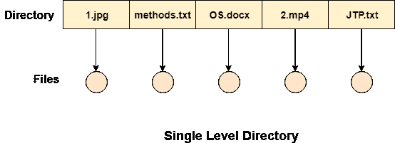

# 单层目录

> 原文：<https://www.javatpoint.com/os-single-level-directory>

最简单的方法是在磁盘上有一个所有文件的大列表。整个系统将只包含一个目录，该目录应该提到文件系统中存在的所有文件。该目录包含文件系统上每个文件的一个条目。

这种类型的目录可以用于简单的系统。

## 优势

1.  实现非常简单。
2.  如果文件的大小非常小，那么搜索会变得更快。
3.  文件的创建、搜索、删除非常简单，因为我们只有一个目录。

## 不足之处

1.  我们不能有两个同名的文件。
2.  该目录可能非常大，因此搜索文件可能需要很长时间。
3.  不能对多个用户实施保护。
4.  没有办法对同类文件进行分组。
5.  为每个文件选择唯一的名称有点复杂，并且会限制系统中的文件数量，因为大多数操作系统都会限制用于构造文件名的字符数。