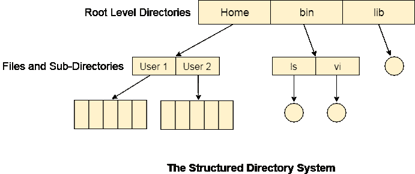

# 树形结构目录

> 原文：<https://www.javatpoint.com/os-tree-structured-directory>

在树形结构目录系统中，任何目录条目都可以是文件或子目录。树形目录系统克服了两级目录系统的缺点。类似的文件现在可以分组到一个目录中。

每个用户都有自己的目录，不能进入其他用户的目录。但是，用户有权读取根的数据，但不能写入或修改这些数据。只有系统管理员才能完全访问根目录。

在这种目录结构中，搜索效率更高。使用当前工作目录的概念。一个文件可以通过两种路径访问，相对路径和绝对路径。

绝对路径是文件相对于系统根目录的路径，而相对路径是相对于系统当前工作目录的路径。在树状目录系统中，用户被授予创建文件和目录的权限。

## 对文件和目录的权限

树形结构的目录系统可能由不同的级别组成，因此每个文件和目录都有一组权限。

权限为 **R W X** ，涉及文件或目录的读取、写入和执行。权限被分配给三种类型的用户:所有者、组和其他人。

有一个区分目录和文件的标识位。对于目录，是 **d** ，对于文件，是点**(。)**

以下快照显示了在基于 Linux 的系统中分配给文件的权限。初始位 **d** 表示它是一个目录。

