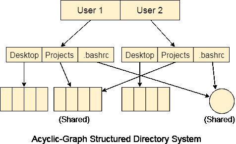

# 非循环图结构目录

> 原文：<https://www.javatpoint.com/os-acyclic-graph-directories>

树形结构目录系统不允许同一文件存在于多个目录中，因此共享是树形结构目录系统的主要问题。我们可以通过使目录成为非循环图来提供共享。在这个系统中，两个或多个目录条目可以指向同一个文件或子目录。该文件或子目录在两个目录条目之间共享。

这类目录图可以使用链接或别名制作。同一个文件可以有多个路径。链接可以是符号链接(逻辑链接)或硬链接(物理链接)。

如果一个文件在非循环图结构目录系统中被删除，那么

1.在软链接的情况下，文件刚刚被删除，我们剩下一个悬空的指针。

2.在硬链接的情况下，只有当所有对它的引用都被删除时，实际的文件才会被删除。

