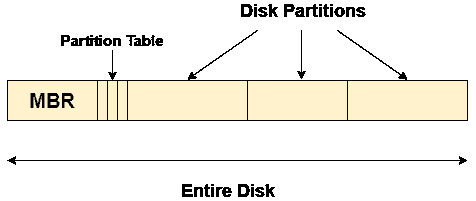

# 主引导记录

> 原文：<https://www.javatpoint.com/os-master-boot-record>

主引导记录是任何硬盘的第一个扇区中存在的信息。它包含有关操作系统在硬盘中的位置和方式的信息，以便在内存中启动。

MBR 有时被称为主分区表，因为它包括一个定位硬盘中每个分区的分区表。

主引导记录(MBR)还包括读取包含操作系统的分区的引导扇区记录的程序。

## 当你打开电脑时会发生什么？

由于主存储器是易失性的，当我们打开电脑时，中央处理器

无法直接访问主内存。然而，当存储在只读存储器中的基本输入输出系统第一次被中央处理器访问时，有一个特殊的程序被称为。

基本输入输出系统包含代码，通过执行该代码，中央处理器可以访问硬盘的第一个分区，即主存储区域。它包含硬盘所有分区的分区表。

因为，MBR 包含操作系统存储位置的信息，它还包含一个可以读取分区引导扇区记录的程序，因此中央处理器获取所有这些信息，并将操作系统加载到主存储器中。