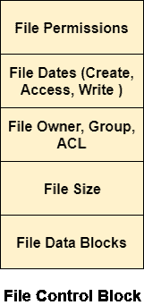

# 关于磁盘数据结构

> 原文：<https://www.javatpoint.com/os-on-disk-data-structures>

有多种磁盘数据结构用于实现文件系统。这种结构可能因操作系统而异。

1.  **启动控制块**

引导控制块包含从该卷引导操作系统所需的所有信息。它在 UNIX 文件系统中被称为引导块。在 NTFS 中，它被称为分区引导扇区。

3.  **音量控制块**

卷控制阻止所有关于该卷的信息，例如块数、每个块的大小、分区表、指向空闲块和空闲 FCB 块的指针。在 UNIX 文件系统中，它被称为超级块。在 NTFS 中，这些信息存储在主文件表中。

5.  **目录结构(每个文件系统)**

目录结构(每个文件系统)包含文件名和指向相应 fcb 的指针。在 UNIX 中，它包括与文件名相关联的信息节点号。

7.  **文件控制块**

文件控制块包含文件的所有细节，如所有权细节、权限细节、文件大小等。在 UFS，此详细信息存储在信息节点中。在 NTFS 中，这些信息作为关系数据库结构存储在主文件表中。下图显示了一个典型的文件控制块。

