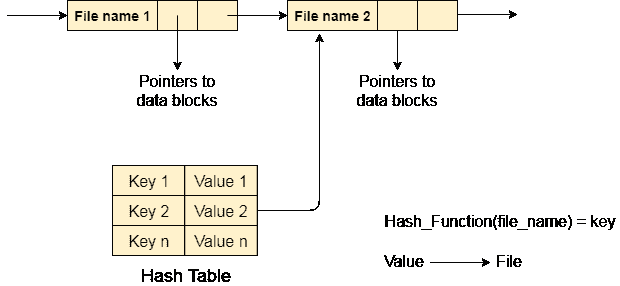

# 目录实现

> 原文：<https://www.javatpoint.com/os-directory-implementation>

有许多算法可以用来实现目录。然而，选择合适的目录实现算法可能会显著影响系统的性能。

目录实现算法根据它们使用的数据结构进行分类。目前使用的算法主要有两种。

### 1.线性列表

在该算法中，目录中的所有文件都被维护为单行列表。每个文件都包含指向分配给它的数据块和目录中下一个文件的指针。

**特征**

2.  创建新文件时，将检查整个列表中的新文件名是否与现有文件名匹配。如果它不存在，文件可以在开头或结尾创建。因此，搜索唯一的名称是一个大问题，因为遍历整个列表需要时间。

4.  在对文件的每个操作(创建、删除、更新等)的情况下，需要遍历列表，因此系统变得低效。

### 2.散列表

为了克服目录的单链表实现的缺点，有一种替代方法，即哈希表。这种方法建议使用哈希表和链表。

目录中每个文件的键值对被生成并存储在哈希表中。当密钥指向存储在目录中的相应文件时，可以通过对文件名应用散列函数来确定密钥。

现在，搜索变得高效，因为现在，不会在每个操作上搜索整个列表。仅使用关键字检查哈希表条目，如果找到条目，则将使用该值提取相应的文件。

